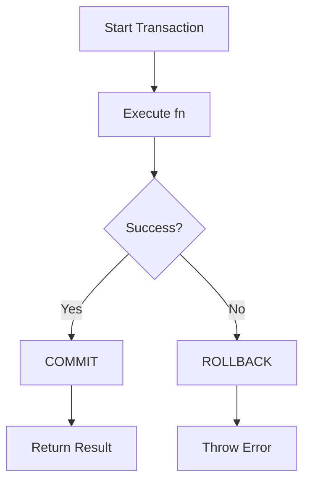

# BaseRepository Class Documentation

## Overview

The `BaseRepository` class provides a **synchronous, type-safe abstraction** over `better-sqlite3` with centralized error handling, logging, and transaction support.

**Location:** `src/main/repositories/base-repository.ts`

---

## Class Structure

```typescript
export abstract class BaseRepository {
  protected db: Database;

  constructor() {
    this.db = databaseManager.getDatabase();
  }

  // Core methods
  protected execute(sql: string, params: unknown[] = []): Database.RunResult;
  protected queryOne<T>(sql: string, params: unknown[] = []): T | undefined;
  protected queryAll<T>(sql: string, params: unknown[] = []): T[];
  protected transaction<T>(fn: () => T): T;

  // Helper methods
  protected exists(sql: string, params: unknown[] = []): boolean;
  protected count(sql: string, params: unknown[] = []): number;

  // Error handling
  private handleError(error: unknown, operation: string): Error;

  // Date utilities (UTC Standardization)
  protected parseDate(dateStr: string): Date;
  protected formatDateForSql(date: Date): string;
}
```

---

## Core Methods

### 1. execute()

**Purpose:** Execute queries that don't return data (INSERT, UPDATE, DELETE)

**Signature:**

```typescript
protected execute(sql: string, params: unknown[] = []): Database.RunResult
```

**Returns:**

```typescript
{
  changes: number; // Number of rows affected
  lastInsertRowid: number; // ID of last inserted row
}
```

**Example:**

```typescript
// Insert a customer
const result = this.execute(
  `
  INSERT INTO customers (name, phone, balance_due)
  VALUES (?, ?, ?)
`,
  ['John Doe', '9876543210', 0]
);

console.log(result.lastInsertRowid); // 1
console.log(result.changes); // 1

// Update a customer
const updateResult = this.execute(
  `
  UPDATE customers SET balance_due = ? WHERE id = ?
`,
  [500.0, 1]
);

console.log(updateResult.changes); // 1
```

**Features:**

- ✅ Automatic logging (debug level)
- ✅ Error handling with context
- ✅ Returns row count and last insert ID

---

### 2. queryOne()

**Purpose:** Query for a single row

**Signature:**

```typescript
protected queryOne<T>(sql: string, params: unknown[] = []): T | undefined
```

**Returns:** Single row or `undefined` if not found

**Example:**

```typescript
// Find customer by ID
const customer = this.queryOne<{ id: number; name: string; phone: string }>(
  `
  SELECT id, name, phone FROM customers WHERE id = ?
`,
  [1]
);

if (customer) {
  console.log(customer.name); // "John Doe"
} else {
  console.log('Customer not found');
}
```

**Features:**

- ✅ Type-safe with generics
- ✅ Returns `undefined` if no row found
- ✅ Automatic logging

---

### 3. queryAll()

**Purpose:** Query for multiple rows

**Signature:**

```typescript
protected queryAll<T>(sql: string, params: unknown[] = []): T[]
```

**Returns:** Array of rows (empty array if no results)

**Example:**

```typescript
// Find all active customers
const customers = this.queryAll<{ id: number; name: string }>(`
  SELECT id, name FROM customers WHERE is_active = 1
`);

console.log(customers.length); // 5
customers.forEach((c) => console.log(c.name));
```

**Features:**

- ✅ Type-safe with generics
- ✅ Returns empty array (never null/undefined)
- ✅ Automatic logging with row count

---

### 4. transaction()

**Purpose:** Execute multiple operations atomically

**Signature:**

```typescript
protected transaction<T>(fn: () => T): T
```

**How It Works:**



**Implementation Details:**

The `transaction()` method delegates to `databaseManager.transaction()`, which uses `better-sqlite3`'s transaction API:

```typescript
// In DatabaseManager
public transaction<T>(fn: () => T): T {
  const txn = this.db.transaction(fn);
  return txn();
}
```

**Under the hood:**

1. `better-sqlite3` wraps `fn` in `BEGIN TRANSACTION`
2. If `fn` completes without error → `COMMIT`
3. If `fn` throws error → `ROLLBACK`
4. Error is re-thrown to caller

**Example 1: Simple Transaction**

```typescript
createCustomer(data: CreateCustomerInput): Customer {
  return this.transaction(() => {
    // 1. Insert customer
    const result = this.execute(`
      INSERT INTO customers (name, phone, balance_due)
      VALUES (?, ?, ?)
    `, [data.name, data.phone, 0]);

    // 2. Log creation
    this.execute(`
      INSERT INTO audit_log (action, entity_id)
      VALUES (?, ?)
    `, ['CUSTOMER_CREATED', result.lastInsertRowid]);

    // 3. Return created customer
    return this.findById(result.lastInsertRowid)!;
  });
}
```

**Example 2: Complex Transaction (Bill Creation)**

```typescript
createBillWithItems(billData: CreateBillInput, items: CreateBillItemInput[]): Bill {
  return this.transaction(() => {
    // 1. Validate stock for all items
    items.forEach(item => {
      const product = this.queryOne<{ stock_qty: number }>(`
        SELECT stock_qty FROM products WHERE id = ? FOR UPDATE
      `, [item.productId]);

      if (!product || product.stock_qty < item.quantity) {
        throw new Error(`Insufficient stock for product ${item.productId}`);
      }
    });

    // 2. Create bill
    const billResult = this.execute(`
      INSERT INTO bills (bill_number, customer_id, subtotal, gst_total, grand_total, payment_mode)
      VALUES (?, ?, ?, ?, ?, ?)
    `, [billData.billNumber, billData.customerId, billData.subtotal, billData.gstTotal, billData.grandTotal, billData.paymentMode]);

    const billId = billResult.lastInsertRowid;

    // 3. Create bill items and deduct stock
    items.forEach(item => {
      // Insert bill item
      this.execute(`
        INSERT INTO bill_items (bill_id, product_id, product_name_snapshot, quantity, unit_price, gst_percent, line_total)
        VALUES (?, ?, ?, ?, ?, ?, ?)
      `, [billId, item.productId, item.productName, item.quantity, item.unitPrice, item.gstPercent, item.lineTotal]);

      // Deduct stock
      this.execute(`
        UPDATE products SET stock_qty = stock_qty - ?, updated_at = datetime('now') WHERE id = ?
      `, [item.quantity, item.productId]);

      // Log inventory change
      this.execute(`
        INSERT INTO inventory_logs (product_id, change_qty, reason, reference_id, notes)
        VALUES (?, ?, 'SALE', ?, ?)
      `, [item.productId, -item.quantity, billId, `Bill #${billData.billNumber}`]);
    });

    // 4. Update customer balance if applicable
    if (billData.customerId) {
      this.execute(`
        UPDATE customers SET balance_due = balance_due + ?, updated_at = datetime('now') WHERE id = ?
      `, [billData.grandTotal - (billData.paymentReceived || 0), billData.customerId]);
    }

    // 5. Return created bill
    return this.findById(billId)!;
  });

  // If ANY step fails, ALL changes are rolled back automatically
}
```

**Transaction Guarantees:**

- ✅ **Atomicity:** All operations succeed or all fail
- ✅ **Consistency:** Database constraints enforced
- ✅ **Isolation:** Other transactions don't see partial changes
- ✅ **Durability:** Committed changes are permanent

**Automatic Rollback:**

```typescript
// This transaction will ROLLBACK automatically
this.transaction(() => {
  this.execute(`INSERT INTO customers (name, phone) VALUES (?, ?)`, ['John', '123']);
  this.execute(`INSERT INTO customers (name, phone) VALUES (?, ?)`, ['Jane', '123']); // UNIQUE violation!
  // Transaction automatically rolled back, first insert is undone
});
```

---

## Helper Methods

### exists()

**Purpose:** Check if a record exists

**Example:**

```typescript
const customerExists = this.exists(
  `
  SELECT COUNT(*) as count FROM customers WHERE phone = ?
`,
  ['9876543210']
);

if (customerExists) {
  throw new Error('Customer with this phone already exists');
}
```

---

### count()

**Purpose:** Get count of records

**Example:**

```typescript
const activeCustomers = this.count(`
  SELECT COUNT(*) as count FROM customers WHERE is_active = 1
`);

console.log(`Active customers: ${activeCustomers}`);
```

---

## Date Utilities (UTC Standardization)

The `BaseRepository` provides standardized helpers for handling dates in UTC, which are then converted to the system's local timezone (IST) in the UI.

### 1. parseDate()

**Purpose:** Convert SQLite date strings (yyyy-mm-dd hh:mm:ss) into JS `Date` objects.

**Behavior:**

- Appends `Z` to SQLite datetime strings to ensure they are interpreted as **UTC**.
- Preserves existing ISO strings that already have `Z` or an offset.

**Example:**

```typescript
const date = this.parseDate('2026-01-01 10:00:00');
// Result: Jan 1 2026, 10:00 AM (UTC) -> ~3:30 PM IST
```

### 2. formatDateForSql()

**Purpose:** Format a JS `Date` object for SQLite storage in UTC.

**Behavior:**

- Generates `YYYY-MM-DD HH:MM:SS` using **UTC** components.

**Example:**

```typescript
const sqlDate = this.formatDateForSql(new Date());
// If current time is 4:30 PM IST, result is "2026-02-22 11:00:00"
```

---

## Error Handling

### DatabaseError Class

**Custom error class with structured information:**

```typescript
export class DatabaseError extends Error {
  public readonly code: string;
  public readonly originalError?: Error;

  constructor(message: string, code: string, originalError?: Error);

  public isCode(code: string): boolean;
  public getUserMessage(): string;
}
```

### Error Codes

| Code                    | SQLite Error                  | User Message                   |
| ----------------------- | ----------------------------- | ------------------------------ |
| `UNIQUE_VIOLATION`      | UNIQUE constraint failed      | Record already exists          |
| `FOREIGN_KEY_VIOLATION` | FOREIGN KEY constraint failed | Referenced data does not exist |
| `NOT_NULL_VIOLATION`    | NOT NULL constraint failed    | Required field is missing      |
| `CHECK_VIOLATION`       | CHECK constraint failed       | Invalid data value             |
| `DATABASE_LOCKED`       | database is locked            | Database is busy, try again    |
| `DATABASE_ERROR`        | Other errors                  | Database operation failed      |

### Error Handling Example

```typescript
try {
  const customer = customerRepo.create({
    name: 'John Doe',
    phone: '9876543210',
    balanceDue: 0,
  });
} catch (error) {
  if (error instanceof DatabaseError) {
    if (error.isCode('UNIQUE_VIOLATION')) {
      console.error('Customer already exists');
      alert(error.getUserMessage()); // "This record already exists..."
    } else {
      console.error('Database error:', error.message);
      alert(error.getUserMessage());
    }
  }
}
```

---

## Logging

**All operations are automatically logged:**

```typescript
// Debug logs (development)
logger.debug('Executing SQL', { sql, params });
logger.debug('SQL executed', { changes: 1, lastId: 42 });

// Error logs (always)
logger.error('SQL execution failed', { sql, params, error });
```

**Log Levels:**

- `debug`: SQL queries, parameters, results (development only)
- `error`: Failed operations with full context (always)

---

## Usage in Repositories

### Extending BaseRepository

```typescript
import { BaseRepository } from './base-repository';

export class CustomerRepository extends BaseRepository {
  // Use protected methods from BaseRepository

  findById(id: number): Customer | null {
    const row = this.queryOne<any>(`SELECT * FROM customers WHERE id = ?`, [id]);
    return row ? this._mapToCustomer(row) : null;
  }

  findAll(): Customer[] {
    const rows = this.queryAll<any>(`SELECT * FROM customers WHERE is_active = 1`);
    return rows.map((row) => this._mapToCustomer(row));
  }

  create(data: CreateCustomerInput): Customer {
    const result = this.execute(
      `
      INSERT INTO customers (name, phone, balance_due)
      VALUES (?, ?, ?)
    `,
      [data.name, data.phone, 0]
    );

    return this.findById(result.lastInsertRowid)!;
  }

  updateBalance(id: number, amount: number): void {
    this.execute(
      `
      UPDATE customers SET balance_due = balance_due + ?, updated_at = datetime('now')
      WHERE id = ?
    `,
      [amount, id]
    );
  }

  private _mapToCustomer(row: any): Customer {
    return {
      id: row.id,
      name: row.name,
      phone: row.phone,
      balanceDue: row.balance_due, // Rupees (direct)
      isActive: row.is_active === 1,
      createdAt: this.parseDate(row.created_at),
      updatedAt: this.parseDate(row.updated_at),
    };
  }
}
```

---

## Production Safety

**The BaseRepository is production-safe:**

✅ **Synchronous Execution**

- No async/await complexity
- Predictable execution order
- No race conditions

✅ **SQL Injection Protection**

- Parameterized queries only
- No string concatenation

✅ **Error Handling**

- All errors caught and wrapped
- User-friendly messages
- Full error context logged

✅ **Transaction Safety**

- Automatic rollback on error
- ACID guarantees
- No partial updates

✅ **Type Safety**

- TypeScript generics
- Compile-time type checking
- No runtime type errors

✅ **Logging**

- Debug logs in development
- Error logs in production
- Full audit trail

---

## Summary

| Feature            | Implementation           | Benefit                                   |
| ------------------ | ------------------------ | ----------------------------------------- |
| **execute()**      | Wraps `stmt.run()`       | INSERT/UPDATE/DELETE with result          |
| **queryOne()**     | Wraps `stmt.get()`       | Type-safe single row queries              |
| **queryAll()**     | Wraps `stmt.all()`       | Type-safe multi-row queries               |
| **transaction()**  | Wraps `db.transaction()` | Atomic operations with auto-rollback      |
| **Error Handling** | Custom DatabaseError     | User-friendly messages, structured errors |
| **Logging**        | Centralized logger       | Debug queries, audit trail                |
| **Type Safety**    | TypeScript generics      | Compile-time safety                       |

**The BaseRepository provides a robust, production-ready foundation for all data access!**
