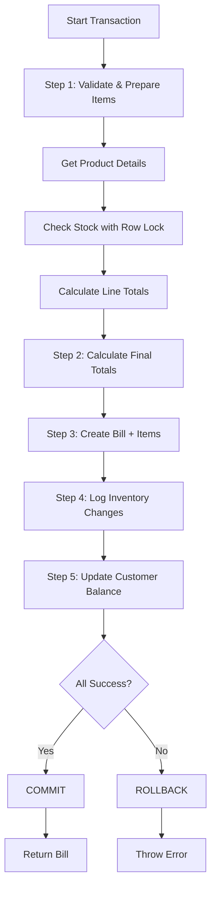

# BillingTransactionService - Transaction Flow

## Overview

The `BillingTransactionService` orchestrates the **complete billing process** in a single atomic transaction, ensuring data consistency and preventing partial updates.

---

## Transaction Flow

### Step-by-Step Execution



---

## Detailed Step Breakdown

### Step 1: Validate and Prepare Bill Items

**Purpose:** Validate products, check stock, calculate totals

```typescript
saleData.items.forEach(item => {
  // 1.1: Get product details
  const product = this.productRepo.findById(item.productId);
  if (!product) throw new Error('Product not found');
  if (!product.isActive) throw new Error('Product inactive');
  
  // 1.2: Check stock availability (WITH ROW LOCK)
  this.productRepo.updateStock(item.productId, -item.quantity);
  // This locks the row and validates stock in one operation
  // Throws error if insufficient stock
  
  // 1.3: Calculate line totals
  const lineSubtotal = product.salePrice * item.quantity;
  const lineGst = (lineSubtotal * product.gstPercent) / 100;
  const lineTotal = lineSubtotal + lineGst;
  
  // 1.4: Accumulate totals
  subtotal += lineSubtotal;
  gstTotal += lineGst;
  
  // 1.5: Prepare bill item with snapshot
  billItems.push({
    productId: product.id,
    productNameSnapshot: product.name,  // SNAPSHOT
    quantity: item.quantity,
    unitPrice: product.salePrice,       // SNAPSHOT
    gstPercent: product.gstPercent,     // SNAPSHOT
    lineTotal: lineTotal
  });
});
```

**Key Points:**
- ✅ Row locking prevents race conditions
- ✅ Stock validation happens here
- ✅ Product details are snapshotted
- ✅ Totals calculated from actual product prices

---

### Step 2: Calculate Final Totals

**Purpose:** Apply discount and calculate grand total

```typescript
const discountAmount = saleData.discountAmount || 0;
const grandTotal = subtotal + gstTotal - discountAmount;
```

**Formula:**
```
Subtotal = Sum of (unit_price × quantity) for all items
GST Total = Sum of (subtotal × gst_percent / 100) for all items
Grand Total = Subtotal + GST Total - Discount
```

---

### Step 3: Create Bill with Items

**Purpose:** Persist bill header and all items atomically

```typescript
const billData: CreateBillInput = {
  billNumber: saleData.billNumber,
  customerId: saleData.customerId,
  subtotal,
  gstTotal,
  discountAmount,
  grandTotal,
  paymentMode: saleData.paymentMode
};

const billWithItems = this.billRepo.createBillWithItems(billData, billItems);
```

**What happens:**
- Insert bill header
- Insert all bill items
- Return complete bill with items
- All in a nested transaction (already inside main transaction)

---

### Step 4: Log Inventory Changes

**Purpose:** Create audit trail for stock movements

```typescript
saleData.items.forEach(item => {
  this.inventoryRepo.logChange({
    productId: item.productId,
    changeQty: -item.quantity,          // Negative = deduction
    reason: 'SALE',
    referenceId: billWithItems.bill.id, // Link to bill
    notes: `Bill #${saleData.billNumber}`
  });
});
```

**Why:**
- Complete audit trail
- Track all stock movements
- Link to source transaction (bill)

---

### Step 5: Update Customer Balance

**Purpose:** Track credit/udhaar if applicable

```typescript
if (saleData.customerId) {
  const paymentReceived = saleData.paymentReceived || 0;
  const balanceChange = grandTotal - paymentReceived;
  
  if (balanceChange !== 0) {
    this.customerRepo.updateBalance(saleData.customerId, balanceChange);
  }
}
```

**Examples:**
- Grand total: ₹500, Payment: ₹500 → Balance change: ₹0 (fully paid)
- Grand total: ₹500, Payment: ₹300 → Balance change: ₹200 (customer owes ₹200)
- Grand total: ₹500, Payment: ₹600 → Balance change: -₹100 (customer has ₹100 advance)

---

## Transaction Guarantees

### All-or-Nothing

```typescript
// ✅ GOOD: All steps succeed
createSale(saleData) → {
  ✓ Bill created
  ✓ Stock deducted
  ✓ Inventory logged
  ✓ Balance updated
  → COMMIT
}

// ✅ GOOD: Any step fails, all rolled back
createSale(saleData) → {
  ✓ Bill created
  ✓ Stock deducted
  ✗ Inventory log fails
  → ROLLBACK (bill and stock changes undone)
}
```

### No Partial Updates

**Without transaction:**
```
❌ Bill created
❌ Stock deducted
✗ Inventory log fails
→ Database in inconsistent state!
```

**With transaction:**
```
✓ Bill created (in transaction)
✓ Stock deducted (in transaction)
✗ Inventory log fails
→ ROLLBACK (everything undone)
→ Database remains consistent!
```

---

## Usage Examples

### Example 1: Simple Cash Sale

```typescript
const billingService = new BillingTransactionService();

const saleData: CreateSaleInput = {
  billNumber: 'BILL-20260208-0001',
  items: [
    { productId: 1, quantity: 2 },  // Coca Cola
    { productId: 4, quantity: 1 }   // Milk
  ],
  paymentMode: 'cash'
};

try {
  const result = billingService.createSale(saleData);
  console.log('Sale completed:', result.bill.billNumber);
  console.log('Grand total:', result.bill.grandTotal);
} catch (error) {
  console.error('Sale failed:', error.message);
  // No partial changes in database
}
```

### Example 2: Credit Sale with Discount

```typescript
const saleData: CreateSaleInput = {
  billNumber: 'BILL-20260208-0002',
  customerId: 1,              // Registered customer
  items: [
    { productId: 6, quantity: 3 }  // Toor Dal
  ],
  paymentMode: 'upi',
  paymentReceived: 400,       // Paid ₹400
  discountAmount: 50          // ₹50 discount
};

const result = billingService.createSale(saleData);
// If grand total is ₹475:
// - Payment received: ₹400
// - Balance change: ₹75 (customer owes ₹75)
```

### Example 3: Validation Before Sale

```typescript
try {
  // Pre-validate (doesn't start transaction)
  billingService.validateSale(saleData);
  
  // If validation passes, create sale
  const result = billingService.createSale(saleData);
} catch (error) {
  if (error.message.includes('Insufficient stock')) {
    alert('Not enough stock available');
  } else if (error.message.includes('already exists')) {
    alert('Bill number already used');
  } else {
    alert('Sale failed: ' + error.message);
  }
}
```

### Example 4: Error Handling

```typescript
try {
  const result = billingService.createSale(saleData);
  console.log('✓ Sale completed');
} catch (error) {
  // Transaction automatically rolled back
  console.error('✗ Sale failed:', error.message);
  
  // Common errors:
  // - "Product not found: 123"
  // - "Insufficient stock for Coca Cola. Available: 5, Required: 10"
  // - "Bill number already exists: BILL-20260208-0001"
  // - "Customer not found: 999"
}
```

---

## Error Scenarios

### Scenario 1: Insufficient Stock

```
Step 1: Validate items
  → Product 1: Stock = 5, Required = 10
  → Error: "Insufficient stock"
  → ROLLBACK (no changes made)
```

### Scenario 2: Duplicate Bill Number

```
Pre-check: Bill number exists
  → Error: "Bill number already exists"
  → Transaction never started
```

### Scenario 3: Database Error

```
Step 3: Create bill
  → Database constraint violation
  → Error: "UNIQUE constraint failed"
  → ROLLBACK (all changes undone)
```

---

## Benefits

| Benefit | Description |
|---------|-------------|
| **Data Consistency** | No partial updates, always consistent |
| **Audit Compliance** | Complete transaction history |
| **Error Recovery** | Automatic rollback on failure |
| **Simplicity** | Single method call for complete sale |
| **Performance** | Single transaction is faster than multiple |
| **Stock Safety** | Row locking prevents overselling |

---

## Summary

**The BillingTransactionService ensures:**

1. ✅ **Atomic Operations** - All steps succeed or all fail
2. ✅ **Stock Safety** - Row locking prevents race conditions
3. ✅ **Audit Trail** - All changes logged
4. ✅ **Customer Tracking** - Balance updated correctly
5. ✅ **Data Integrity** - No partial bills or inconsistent state

**This provides POS-grade reliability with complete transaction safety!**
