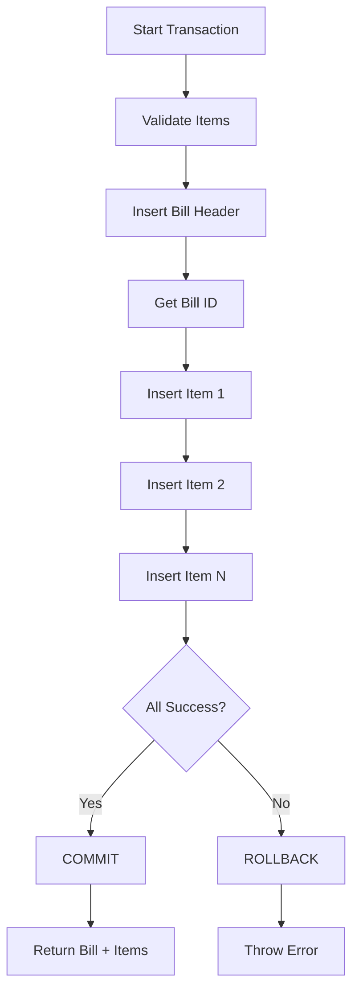

# BillRepository - Atomic Persistence

## Overview

The `BillRepository` ensures that **bills and their items are always saved together** in a single atomic transaction. This prevents partial bills and maintains data integrity.

---

## Atomic Bill Creation

### The Problem

**Without atomic persistence:**

```typescript
// ❌ BAD: Non-atomic (can create partial bills)
const billId = createBill(billData); // Step 1: Insert bill
createBillItem(billId, item1); // Step 2: Insert item 1
createBillItem(billId, item2); // Step 3: Insert item 2 → FAILS!
// Result: Bill exists with only 1 item (INCONSISTENT STATE)
```

**Issues:**

- Bill exists without all items
- Database is in inconsistent state
- Cannot recover easily
- Reports show incorrect data

---

### The Solution: Transaction

```typescript
// ✅ GOOD: Atomic transaction
createBillWithItems(billData, items) {
  return this.transaction(() => {
    // 1. Create bill
    const billId = insertBill(billData);

    // 2. Create all items
    items.forEach(item => insertBillItem(billId, item));

    // 3. Return complete bill
    return { bill, items };
  });

  // If ANY step fails → ROLLBACK all changes
  // If all succeed → COMMIT all changes
}
```

---

## How It Works

### Step-by-Step Flow



### Code Implementation

```typescript
public createBillWithItems(
  billData: CreateBillInput,
  items: CreateBillItemInput[]
): BillWithItems {
  return this.transaction(() => {
    // 1. Validate
    if (!items || items.length === 0) {
      throw new Error('Bill must have at least one item');
    }

    // 2. Create bill header
    const billResult = this.execute(`
      INSERT INTO bills (bill_number, customer_id, subtotal, gst_total,
                         discount_amount, grand_total, payment_mode)
      VALUES (?, ?, ?, ?, ?, ?, ?)
    `, [
      billData.billNumber,
      billData.customerId || null,
      billData.subtotal,
      billData.gstTotal,
      billData.discountAmount || 0,
      billData.grandTotal,
      billData.paymentMode
    ]);

    const billId = Number(billResult.lastInsertRowid);

    // 3. Create all bill items
    items.forEach(item => {
      this.execute(`
        INSERT INTO bill_items (bill_id, product_id, product_name_snapshot,
                                quantity, unit_price, gst_percent, line_total)
        VALUES (?, ?, ?, ?, ?, ?, ?)
      `, [
        billId,
        item.productId,
        item.productNameSnapshot,              // SNAPSHOT
        item.quantity,
        item.unitPrice,
        item.gstPercent,
        item.lineTotal
      ]);
    });

    // 4. Fetch and return
    const bill = this.findById(billId)!;
    const billItems = this.findItemsByBillId(billId);

    return { bill, items: billItems };
  });
}
```

---

## Key Design Decisions

### 1. Immutable Totals

**Totals are stored, not calculated:**

```typescript
// ✅ GOOD: Store final totals
const bill = {
  subtotal: 100.0, // Stored in database
  gstTotal: 18.0, // Stored in database
  discountAmount: 5.0, // Stored in database
  grandTotal: 113.0, // Stored in database (FINAL)
};

// ❌ BAD: Calculate on read
const grandTotal = bill.subtotal + bill.gstTotal - bill.discountAmount;
// Problem: If calculation logic changes, old bills show wrong totals
```

**Why?**

- Historical accuracy (old bills never change)
- Audit compliance (totals are final)
- Performance (no recalculation needed)
- Simplicity (no complex queries)

---

### 2. Product Snapshots

**Product details are captured at time of sale:**

```typescript
// ✅ GOOD: Snapshot product details
const billItem = {
  productId: 101,
  productNameSnapshot: 'Coca Cola 500ml', // Name at time of sale
  unitPrice: 40.0, // Price at time of sale
  gstPercent: 18.0, // GST at time of sale
};

// ❌ BAD: Reference product table
const billItem = {
  productId: 101, // Only store ID, lookup name later
};
// Problem: If product name/price changes, old bills show wrong data
```

**Why?**

- Historical accuracy (product details may change)
- Audit compliance (bills must show what was actually sold)
- Performance (no joins needed to display bills)

---

### 3. Single Transaction

**All operations in one transaction:**

```typescript
// ✅ GOOD: Single transaction
this.transaction(() => {
  insertBill();
  insertItem1();
  insertItem2();
  insertItem3();
});

// ❌ BAD: Multiple transactions
insertBill(); // Transaction 1
insertItem1(); // Transaction 2
insertItem2(); // Transaction 3 → FAILS
// Result: Bill + 1 item saved, item 2 missing
```

**Guarantees:**

- All-or-nothing (no partial bills)
- Data consistency (bill always has all items)
- Rollback on error (automatic cleanup)

---

## Usage Examples

### Example 1: Simple Cash Sale

```typescript
const billRepo = new BillRepository();

const billData: CreateBillInput = {
  billNumber: 'BILL-20260208-0001',
  customerId: null, // Walk-in customer
  subtotal: 100.0,
  gstTotal: 18.0,
  discountAmount: 0,
  grandTotal: 118.0,
  paymentMode: 'cash',
};

const items: CreateBillItemInput[] = [
  {
    productId: 1,
    productNameSnapshot: 'Coca Cola 500ml',
    quantity: 2,
    unitPrice: 40.0,
    gstPercent: 18.0,
    lineTotal: 94.4,
  },
  {
    productId: 4,
    productNameSnapshot: 'Amul Milk 1L',
    quantity: 1,
    unitPrice: 60.0,
    gstPercent: 0.0,
    lineTotal: 60.0,
  },
];

const result = billRepo.createBillWithItems(billData, items);
console.log(result.bill.billNumber); // BILL-20260208-0001
console.log(result.items.length); // 2
```

### Example 2: Credit Sale with Discount

```typescript
const billData: CreateBillInput = {
  billNumber: 'BILL-20260208-0002',
  customerId: 1, // Registered customer
  subtotal: 500.0,
  gstTotal: 25.0,
  discountAmount: 50.0,
  grandTotal: 475.0,
  paymentMode: 'upi',
};

const items: CreateBillItemInput[] = [
  {
    productId: 6,
    productNameSnapshot: 'Toor Dal 1kg',
    quantity: 3,
    unitPrice: 150.0,
    gstPercent: 5.0,
    lineTotal: 472.5,
  },
];

const result = billRepo.createBillWithItems(billData, items);
```

### Example 3: Error Handling

```typescript
try {
  const result = billRepo.createBillWithItems(billData, items);
  console.log('Bill created:', result.bill.billNumber);
} catch (error) {
  if (error.message.includes('UNIQUE constraint failed')) {
    console.error('Bill number already exists');
  } else if (error.message.includes('FOREIGN KEY constraint failed')) {
    console.error('Invalid customer or product ID');
  } else {
    console.error('Failed to create bill:', error.message);
  }

  // No partial bill in database (transaction rolled back)
}
```

---

## Query Methods

### Find Bill by Number

```typescript
const bill = billRepo.findByBillNumber('BILL-20260208-0001');
if (bill) {
  console.log(bill.grandTotal); // 118.00
}
```

### Find Bill with Items

```typescript
const result = billRepo.findByBillNumberWithItems('BILL-20260208-0001');
if (result) {
  console.log(result.bill.billNumber);
  console.log(result.items.length);
  result.items.forEach((item) => {
    console.log(`${item.productNameSnapshot}: ${item.quantity} × ₹${item.unitPrice}`);
  });
}
```

### List Bills by Date Range

```typescript
const fromDate = new Date('2026-02-01');
const toDate = new Date('2026-02-28');

const bills = billRepo.findByDateRange(fromDate, toDate);
console.log(`Found ${bills.length} bills`);
```

### Get Today's Bills

```typescript
const todayBills = billRepo.findToday();
console.log(`Today's bills: ${todayBills.length}`);
```

### Sales Summary

```typescript
const summary = billRepo.getSalesSummary(fromDate, toDate);
console.log(`Total Bills: ${summary.totalBills}`);
console.log(`Total Sales: ₹${summary.totalSales}`);
console.log(`Total GST: ₹${summary.totalGst}`);
console.log(`Total Discount: ₹${summary.totalDiscount}`);
```

---

## Benefits of Atomic Persistence

| Benefit                 | Description                                |
| ----------------------- | ------------------------------------------ |
| **Data Integrity**      | No partial bills, always consistent        |
| **Audit Compliance**    | Complete transaction history               |
| **Error Recovery**      | Automatic rollback on failure              |
| **Simplicity**          | Single method call for complete bill       |
| **Performance**         | Single transaction is faster than multiple |
| **Historical Accuracy** | Snapshots preserve original data           |

---

## Summary

**The BillRepository ensures:**

1. ✅ **Atomic Operations** - Bill + items saved together
2. ✅ **Immutable Totals** - Final amounts stored, never recalculated
3. ✅ **Product Snapshots** - Historical accuracy preserved
4. ✅ **Transaction Safety** - All-or-nothing persistence
5. ✅ **Error Handling** - Automatic rollback on failure

**This design provides POS-grade reliability and audit compliance!**
