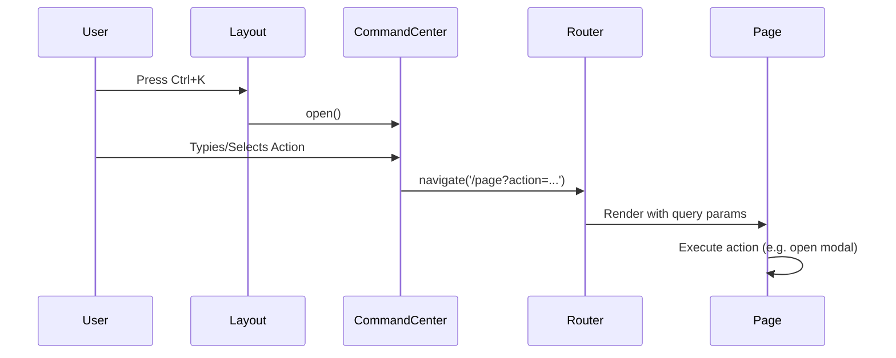

# Command Center Architecture

## Overview

The **Command Center** is a unified navigation and action hub accessible via `Ctrl+K`. It provides zero-friction access to high-frequency actions and page navigation, similar to modern developer tools (VS Code, Slack).

---

## Technical Flow



## Key Components

### 1. `CommandCenter.tsx`

- **Shortcut Handler**: Listens for `keydown` (Ctrl+K).
- **Fuse.js Integration**: (Optional but recommended for future) Provides fuzzy search for commands.
- **Action Dispatcher**: Uses `useNavigate` to switch contexts while passing specific flags via URL parameters.

### 2. Action Hooks

Components listen for URL parameters to trigger secondary actions:

- `?action=add-product` -> Opens Product Create Modal.
- `?action=add-customer` -> Opens Customer Create Modal.
- `?action=daily-report` -> Loads specific report view.

---

## User Interaction Design

| Element        | Description                                                        |
| :------------- | :----------------------------------------------------------------- |
| **Shortcut**   | `Ctrl+K` to open, `Esc` to close.                                  |
| **Focus**      | Auto-focuses the search bar on open.                               |
| **Navigation** | `ArrowDown`/`ArrowUp` to select, `Enter` to execute.               |
| **Feedback**   | Hover states and active item highlighting using `--color-primary`. |

---

## UI Token Usage

- **Background**: Uses a glassmorphism effect (semi-transparent with `backdrop-filter`).
- **Typography**: Uses `var(--font-size-lg)` for action labels.
- **Shortcuts**: Displayed using `<kbd>` tags in the UI.

---

## Extending the Command Center

To add a new action:

1. Open `src/renderer/components/layout/CommandCenter.tsx`.
2. Add a new item to the `actions` array.
3. Define the destination route and optional query parameters.
4. Ensure the target page handles the query parameter via `useSearchParams`.

**Example:**

```typescript
{
  id: 'settings-printer',
  label: 'Printer Settings',
  icon: <PrinterIcon />,
  handler: () => navigate('/settings?tab=printer')
}
```
