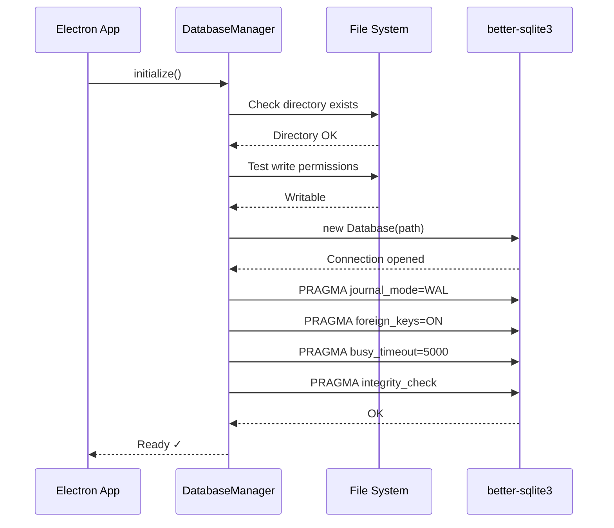
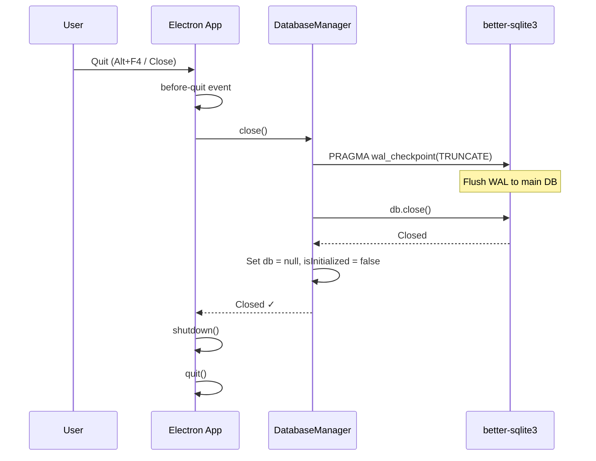

# Database Connection Manager - Lifecycle & Integration

## Overview

The `DatabaseManager` class in `src/main/database/index.ts` is a **singleton** that manages the entire lifecycle of the SQLite database connection using `better-sqlite3`.

---

## Singleton Pattern

```typescript
// Singleton instance exported
export const databaseManager = new DatabaseManager();
```

**Why Singleton?**
- SQLite works best with a single connection per database file
- Prevents connection leaks and race conditions
- Centralized state management
- Thread-safe in Node.js (single-threaded event loop)

---

## Public API

### Core Methods

| Method | Purpose | When to Call |
|--------|---------|--------------|
| `initialize()` | Open connection, configure DB | App startup (once) |
| `getDatabase()` | Get DB instance for queries | In repositories |
| `close()` | Close connection gracefully | App shutdown |
| `transaction(fn)` | Execute atomic transactions | Critical operations (sales) |
| `isReady()` | Check if DB is ready | Health checks |
| `getDatabasePath()` | Get DB file path | Backup/restore |

---

## Lifecycle Flow

### 1. App Startup



**Code Integration** (`src/main/index.ts`):

```typescript
app.whenReady().then(() => {
  // ... other initialization ...
  
  // Initialize database BEFORE IPC handlers
  try {
    databaseManager.initialize();
    logger.info('Database initialized successfully');
  } catch (error) {
    // Show error dialog and quit
    dialog.showErrorBox('Database Initialization Failed', ...);
    app.quit();
    return;
  }
  
  // Register IPC handlers (they can now use DB)
  registerIPCHandlers();
  
  createWindow();
});
```

---

### 2. Normal Operation

**Repository Usage:**

```typescript
import { databaseManager } from '@main/database';

class ProductRepository {
  private db = databaseManager.getDatabase();
  
  findAll(): Product[] {
    const stmt = this.db.prepare('SELECT * FROM products');
    return stmt.all() as Product[];
  }
  
  create(product: CreateProductRequest): Product {
    return databaseManager.transaction(() => {
      const stmt = this.db.prepare(
        'INSERT INTO products (name, price, stock) VALUES (?, ?, ?)'
      );
      const result = stmt.run(product.name, product.price, product.stock);
      return { id: result.lastInsertRowid, ...product };
    });
  }
}
```

**Key Points:**
- `getDatabase()` returns the same connection instance every time
- Throws error if called before `initialize()`
- Synchronous API (no async/await needed)

---

### 3. App Shutdown



**Code Integration** (`src/main/index.ts`):

```typescript
app.on('before-quit', async (event) => {
  if (!shutdownManager.isShutdownInProgress()) {
    event.preventDefault();
    
    // Close database connection
    try {
      databaseManager.close();
      logger.info('Database connection closed');
    } catch (error) {
      logger.error('Error closing database', { error });
    }
    
    await shutdownManager.shutdown();
    app.quit();
  }
});
```

**Why WAL Checkpoint?**
- Ensures all pending writes are flushed to main database file
- Prevents data loss on abnormal shutdown
- Reduces WAL file size

---

## Preventing Multiple Connections

### Built-in Safeguards

**1. Singleton Pattern:**
```typescript
// Only one instance exists
export const databaseManager = new DatabaseManager();
```

**2. Initialization Guard:**
```typescript
public initialize(): void {
  if (this.isInitialized) {
    logger.warn('Database already initialized');
    return; // Silently ignore duplicate calls
  }
  // ... initialization logic
}
```

**3. State Tracking:**
```typescript
private db: Database.Database | null = null;
private isInitialized = false;

public getDatabase(): Database.Database {
  if (!this.db || !this.isInitialized) {
    throw new Error('Database not initialized. Call initialize() first.');
  }
  return this.db;
}
```

**Result:**
- ✅ Calling `initialize()` multiple times is safe (no-op after first call)
- ✅ Calling `getDatabase()` before `initialize()` throws clear error
- ✅ Only one connection exists throughout app lifecycle

---

## Safe Shutdown Handling

### Graceful Shutdown Steps

1. **Checkpoint WAL:**
   ```typescript
   this.db.pragma('wal_checkpoint(TRUNCATE)');
   ```
   - Flushes all WAL entries to main DB
   - Truncates WAL file to 0 bytes
   - Ensures data durability

2. **Close Connection:**
   ```typescript
   this.db.close();
   ```
   - Releases file locks
   - Frees memory
   - Closes file descriptors

3. **Reset State:**
   ```typescript
   this.db = null;
   this.isInitialized = false;
   ```
   - Allows garbage collection
   - Prevents use-after-close errors

### Error Handling

```typescript
public close(): void {
  if (this.db) {
    try {
      this.db.pragma('wal_checkpoint(TRUNCATE)');
      this.db.close();
      logger.info('Database connection closed');
    } catch (error) {
      logger.error('Error closing database', { error });
      // Don't throw - we're shutting down anyway
    } finally {
      this.db = null;
      this.isInitialized = false;
      // Always reset state, even if close failed
    }
  }
}
```

**Why `finally`?**
- Guarantees state reset even if close fails
- Prevents memory leaks
- Allows app to quit cleanly

---

## Reconnect Support (Future)

The current implementation doesn't support reconnection, but the architecture is ready:

```typescript
// Future enhancement
public reconnect(): void {
  if (this.isInitialized) {
    this.close();
  }
  this.initialize();
}

// Usage: Handle database lock errors
try {
  const products = db.prepare('SELECT * FROM products').all();
} catch (error) {
  if (error.code === 'SQLITE_BUSY') {
    logger.warn('Database locked, attempting reconnect');
    databaseManager.reconnect();
    // Retry operation
  }
}
```

**Why Not Implemented Yet?**
- `busy_timeout = 5000` handles most lock scenarios
- Reconnection adds complexity
- Not needed for single-user POS app
- Can be added when multi-user support is required

---

## Integration Points

### 1. Main Process Startup
```typescript
// src/main/index.ts
app.whenReady().then(() => {
  databaseManager.initialize(); // ← Called here
  registerIPCHandlers();
  createWindow();
});
```

### 2. Repositories
```typescript
// src/main/repositories/product-repository.ts
import { databaseManager } from '@main/database';

class ProductRepository {
  private db = databaseManager.getDatabase(); // ← Used here
  // ...
}
```

### 3. Migrations
```typescript
// src/main/database/migrations.ts
import { databaseManager } from '@main/database';

export function runMigrations() {
  const db = databaseManager.getDatabase(); // ← Used here
  // Run migration SQL
}
```

### 4. IPC Handlers
```typescript
// src/main/ipc/handlers/product-handlers.ts
import { productRepository } from '@main/repositories';

IPCHandler.handle('product:list', async () => {
  return productRepository.findAll(); // ← Indirectly uses DB
});
```

### 5. App Shutdown
```typescript
// src/main/index.ts
app.on('before-quit', async () => {
  databaseManager.close(); // ← Called here
  await shutdownManager.shutdown();
});
```

---

## Summary

| Aspect | Implementation | Benefit |
|--------|----------------|---------|
| **Pattern** | Singleton | One connection, no conflicts |
| **Initialization** | Idempotent `initialize()` | Safe to call multiple times |
| **State Tracking** | `isInitialized` flag | Prevents use before ready |
| **Shutdown** | WAL checkpoint + close | Data safety on quit |
| **Error Handling** | Try-catch with logging | Graceful degradation |
| **Synchronous API** | better-sqlite3 | Simple, fast, reliable |

---

**The connection manager is already fully implemented and integrated into your app!**

No additional code needed - it's production-ready.
