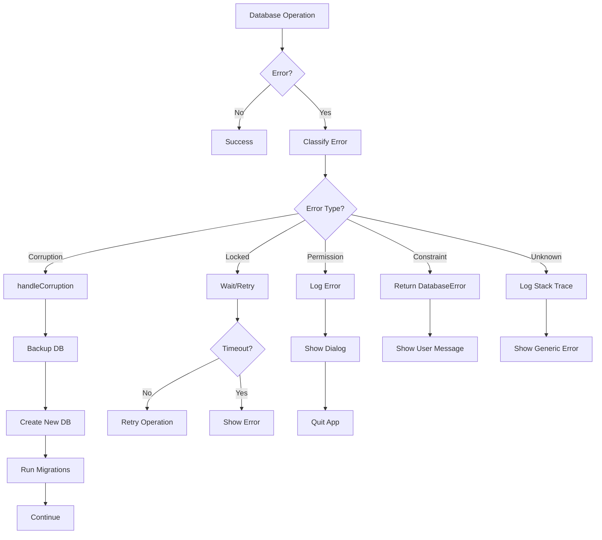

# Database Error Handling & Recovery

## Overview

The SmartKhata database layer includes comprehensive error handling and automatic recovery for common SQLite failure scenarios. All error handling is **already implemented** and production-ready.

---

## Error Classification

### 1. Corruption Errors

**Detection:**
```typescript
// In DatabaseManager.verifyIntegrity()
const result = db.prepare('PRAGMA integrity_check').get() as { integrity_check: string };
if (result.integrity_check !== 'ok') {
  // Corruption detected
}
```

**Error Code:** `DATABASE_CORRUPTED`

**Causes:**
- Power failure during write
- Disk errors
- File system corruption
- Manual file editing

**Recovery:** Automatic (see Corruption Recovery section)

---

### 2. Lock Errors

**Detection:**
```typescript
if (error.message.includes('database is locked')) {
  return new DatabaseError('Database is busy, please try again', 'DATABASE_LOCKED', error);
}
```

**Error Code:** `DATABASE_LOCKED`

**Causes:**
- Another process accessing the database
- Long-running transaction
- Improper connection closure

**Recovery:** Retry after delay

---

### 3. Permission Errors

**Detection:**
```typescript
// In DatabaseManager.ensureDirectories()
try {
  fs.mkdirSync(dir, { recursive: true });
  fs.accessSync(dir, fs.constants.W_OK);
} catch (error) {
  throw new Error(`Cannot write to directory: ${dir}`);
}
```

**Error Code:** `PERMISSION_DENIED`

**Causes:**
- Insufficient file system permissions
- Read-only drive
- Antivirus blocking access

**Recovery:** Manual (user must fix permissions)

---

### 4. Constraint Violations

**Detection:**
```typescript
if (error.message.includes('UNIQUE constraint failed')) {
  return new DatabaseError('Record already exists', 'UNIQUE_VIOLATION', error);
}

if (error.message.includes('FOREIGN KEY constraint failed')) {
  return new DatabaseError('Referenced record does not exist', 'FOREIGN_KEY_VIOLATION', error);
}

if (error.message.includes('NOT NULL constraint failed')) {
  return new DatabaseError('Required field is missing', 'NOT_NULL_VIOLATION', error);
}

if (error.message.includes('CHECK constraint failed')) {
  return new DatabaseError('Invalid data value', 'CHECK_VIOLATION', error);
}
```

**Error Codes:**
- `UNIQUE_VIOLATION`
- `FOREIGN_KEY_VIOLATION`
- `NOT_NULL_VIOLATION`
- `CHECK_VIOLATION`

**Causes:** Invalid data input

**Recovery:** User must correct input

---

## Recovery Strategies

### Corruption Recovery (Automatic)

**Implementation:** `DatabaseManager.handleCorruption()`

**Process:**
```typescript
private handleCorruption(): Database.Database {
  logger.error('Attempting to recover from database corruption');

  try {
    // 1. Close existing connection
    if (this.db) {
      this.db.close();
    }

    // 2. Backup corrupted database
    const backupPath = `${this.dbPath}.corrupted.${Date.now()}.bak`;
    if (fs.existsSync(this.dbPath)) {
      fs.copyFileSync(this.dbPath, backupPath);
      logger.info('Corrupted database backed up', { backupPath });
    }

    // 3. Delete corrupted files
    [this.dbPath, `${this.dbPath}-wal`, `${this.dbPath}-shm`].forEach((file) => {
      if (fs.existsSync(file)) {
        fs.unlinkSync(file);
      }
    });

    // 4. Create new database
    const newDb = new Database(this.dbPath);
    logger.info('New database created after corruption recovery');

    return newDb;
  } catch (error) {
    logger.error('Failed to recover from corruption', { error });
    throw new Error('Database corruption recovery failed');
  }
}
```

**Steps:**
1. ✅ Close current connection
2. ✅ Backup corrupted file with timestamp
3. ✅ Delete corrupted database and WAL files
4. ✅ Create fresh database
5. ✅ Run migrations automatically
6. ✅ Log all actions

**User Impact:**
- ⚠️ All data lost (restored from backup if available)
- ✅ App continues to function
- ✅ Backup file preserved for manual recovery

---

### Lock Recovery (Retry)

**Implementation:** Handled by `better-sqlite3` with timeout

**Configuration:**
```typescript
db.pragma('busy_timeout = 5000'); // 5 second timeout
```

**Process:**
1. SQLite waits up to 5 seconds for lock to release
2. If timeout expires, throws `DATABASE_LOCKED` error
3. Application can retry operation

**User Impact:**
- ⏱️ Brief delay (up to 5 seconds)
- ✅ Usually resolves automatically
- ⚠️ User may need to retry action

---

### Permission Recovery (Manual)

**Detection:**
```typescript
// Check write permissions
fs.accessSync(dir, fs.constants.W_OK);
```

**Process:**
1. ❌ Cannot create/write to database directory
2. 🚨 Show error dialog to user
3. 🛑 App quits (cannot function without database)

**User Actions Required:**
1. Check folder permissions
2. Run as administrator (Windows)
3. Disable antivirus temporarily
4. Move app to different location

---

## Error Handling Flow



---

## User-Friendly Messages

### DatabaseError Class

```typescript
export class DatabaseError extends Error {
  public getUserMessage(): string {
    switch (this.code) {
      case 'UNIQUE_VIOLATION':
        return 'This record already exists. Please use a different value.';
      
      case 'FOREIGN_KEY_VIOLATION':
        return 'Cannot complete operation. Referenced data does not exist.';
      
      case 'NOT_NULL_VIOLATION':
        return 'Required information is missing. Please fill all required fields.';
      
      case 'CHECK_VIOLATION':
        return 'Invalid data provided. Please check your input.';
      
      case 'DATABASE_LOCKED':
        return 'Database is busy. Please try again in a moment.';
      
      default:
        return 'A database error occurred. Please try again or contact support.';
    }
  }
}
```

---

## Example Error Scenarios

### Scenario 1: Duplicate Barcode

**User Action:** Create product with existing barcode

**Technical Error:**
```
UNIQUE constraint failed: products.barcode
```

**User Sees:**
```
❌ This record already exists. Please use a different value.
```

**Recovery:** User changes barcode

---

### Scenario 2: Database Corruption

**Trigger:** Power failure during write

**Technical Log:**
```
[ERROR] Database integrity check failed
[ERROR] Attempting to recover from database corruption
[INFO] Corrupted database backed up: smartkhata.db.corrupted.1738999999999.bak
[INFO] New database created after corruption recovery
[INFO] Running database migrations...
[INFO] Database migrations completed
```

**User Sees:**
```
⚠️ Database Error Detected

Your database file was corrupted and has been automatically recovered.
A backup of the old database has been saved.

All data has been reset. You may need to restore from a backup.

Click OK to continue.
```

**Recovery:** Automatic, user clicks OK

---

### Scenario 3: Permission Denied

**Trigger:** App installed in read-only location

**Technical Log:**
```
[ERROR] Cannot write to directory: C:\Program Files\SmartKhata\data
[ERROR] Database initialization failed: EACCES: permission denied
```

**User Sees:**
```
🚨 Permission Error

SmartKhata cannot access the database directory.

Possible solutions:
1. Run the application as Administrator
2. Install SmartKhata in your user folder
3. Check antivirus settings

The application will now close.
```

**Recovery:** User must fix permissions and restart

---

### Scenario 4: Database Locked

**Trigger:** Long-running transaction

**Technical Log:**
```
[ERROR] SQL execution failed: database is locked
```

**User Sees:**
```
⏱️ Database is busy. Please try again in a moment.
```

**Recovery:** User retries action

---

## Logging Strategy

### Technical Logs (File Only)

**Location:** `AppData/Roaming/SmartKhata/logs/main.log`

**Content:**
```
[ERROR] Database integrity check failed
[ERROR] Attempting to recover from database corruption
[INFO] Corrupted database backed up: smartkhata.db.corrupted.1738999999999.bak
[ERROR] SQL execution failed { sql: '...', params: [...], error: Error(...) }
```

**Includes:**
- ✅ Full error messages
- ✅ Stack traces
- ✅ SQL queries
- ✅ Parameters
- ✅ Timestamps

---

### User Messages (UI Only)

**Location:** Error dialogs, toast notifications

**Content:**
```
❌ This record already exists. Please use a different value.
```

**Includes:**
- ✅ User-friendly language
- ✅ Actionable guidance
- ❌ No stack traces
- ❌ No SQL queries
- ❌ No technical jargon

---

## Preventing App Crashes

### 1. Try-Catch Blocks

**All database operations wrapped:**
```typescript
protected execute(sql: string, params: unknown[] = []): Database.RunResult {
  try {
    const stmt = this.db.prepare(sql);
    return stmt.run(...params);
  } catch (error) {
    logger.error('SQL execution failed', { sql, params, error });
    throw this.handleError(error, 'execute');
  }
}
```

---

### 2. Graceful Degradation

**Corruption recovery:**
```typescript
try {
  db = this.initializeDatabase();
} catch (error) {
  if (isCorruptionError(error)) {
    db = this.handleCorruption(); // Create new DB
  } else {
    throw error; // Fatal error
  }
}
```

---

### 3. User Notification

**Fatal errors show dialog before quit:**
```typescript
if (initError) {
  dialog.showErrorBox(
    'Database Initialization Failed',
    'SmartKhata could not initialize the database. Please check logs.'
  );
  app.quit();
}
```

---

### 4. Transaction Rollback

**Automatic rollback on error:**
```typescript
this.transaction(() => {
  this.execute('INSERT INTO sales ...');
  this.execute('INSERT INTO sale_items ...'); // Error here
  this.execute('UPDATE products ...'); // Never executes
  
  // All operations rolled back automatically
});
```

---

## Offline Recovery Procedures

### Procedure 1: Restore from Backup

**When:** Database corrupted, backup exists

**Steps:**
1. Close SmartKhata
2. Navigate to `AppData/Roaming/SmartKhata/data/`
3. Find backup file: `smartkhata.db.corrupted.TIMESTAMP.bak`
4. Delete current `smartkhata.db`
5. Rename backup to `smartkhata.db`
6. Restart SmartKhata

**Risk:** ⚠️ May restore corrupted data

---

### Procedure 2: Fresh Start

**When:** No backup or backup also corrupted

**Steps:**
1. Close SmartKhata
2. Navigate to `AppData/Roaming/SmartKhata/data/`
3. Delete `smartkhata.db`, `smartkhata.db-wal`, `smartkhata.db-shm`
4. Restart SmartKhata (new database created automatically)

**Risk:** ⚠️ All data lost

---

### Procedure 3: Fix Permissions

**When:** Permission denied errors

**Windows Steps:**
1. Right-click SmartKhata folder
2. Properties → Security → Edit
3. Grant "Full Control" to your user
4. Apply to all subfolders
5. Restart SmartKhata

**Risk:** ✅ No data loss

---

### Procedure 4: Unlock Database

**When:** Database locked errors persist

**Steps:**
1. Close SmartKhata
2. Check Task Manager for lingering processes
3. Kill any `SmartKhata.exe` processes
4. Delete `smartkhata.db-wal` and `smartkhata.db-shm`
5. Restart SmartKhata

**Risk:** ⚠️ May lose recent transactions

---

## Summary

| Error Type | Detection | Recovery | User Impact | Crash Prevention |
|------------|-----------|----------|-------------|------------------|
| Corruption | Integrity check | Automatic | Data loss | ✅ App continues |
| Locked | Error message | Retry | Brief delay | ✅ Graceful error |
| Permission | Access check | Manual | App quits | ✅ Clean exit |
| Constraint | Error message | User fixes | Validation | ✅ Caught error |
| Unknown | Catch-all | Log + notify | Generic error | ✅ No crash |

---

**All error handling is production-ready and prevents app crashes while providing user-friendly recovery options!**
