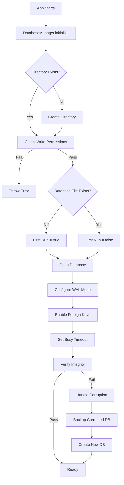

# Database Initialization

## Overview

The database initialization module (`src/main/database/index.ts`) handles all aspects of SQLite database lifecycle management, from first-run setup to corruption recovery.

---

## Path Resolution

### Development
```
<project-root>/dev-data/smartkhata.db
```

### Production
```
C:\Users\<Username>\AppData\Roaming\SmartKhata\data\smartkhata.db
```

**Implementation:**
- Uses Electron's `app.getPath('userData')` for OS-safe paths
- Automatically resolves based on `NODE_ENV`
- Configured in `src/main/config/app-config.ts`

---

## Initialization Flow



---

## First-Run Detection

The system detects first run by checking if the database file exists:

```typescript
const isFirstRun = !fs.existsSync(this.dbPath);
```

**On First Run:**
1. Database file is created automatically by `better-sqlite3`
2. Migrations will run to create schema (handled separately)
3. Seed data can be inserted (optional)

**On Subsequent Runs:**
1. Existing database is opened
2. Integrity check is performed
3. Pending migrations are applied

---

## Folder Creation

### Directory Structure Created

```
Development:
<project-root>/
└── dev-data/
    ├── smartkhata.db
    ├── smartkhata.db-wal
    └── smartkhata.db-shm

Production:
C:\Users\<Username>\AppData\Roaming\SmartKhata\
├── data/
│   ├── smartkhata.db
│   ├── smartkhata.db-wal
│   └── smartkhata.db-shm
├── backups/
└── logs/
```

### Permission Verification

Before opening the database, the system:
1. Creates directory with `fs.mkdirSync(dir, { recursive: true })`
2. Tests write permissions by creating a temporary file
3. Throws error if directory is not writable

```typescript
const testFile = path.join(dbDir, '.write-test');
fs.writeFileSync(testFile, 'test');
fs.unlinkSync(testFile);
```

---

## Database Configuration

### WAL Mode (Write-Ahead Logging)

```sql
PRAGMA journal_mode = WAL;
```

**Benefits:**
- Readers don't block writers
- Writers don't block readers
- Better crash recovery
- Faster writes

### Foreign Keys

```sql
PRAGMA foreign_keys = ON;
```

Enforces referential integrity (e.g., sales must reference valid products).

### Busy Timeout

```sql
PRAGMA busy_timeout = 5000;
```

Waits up to 5 seconds for locks instead of failing immediately.

### Synchronous Mode

```sql
PRAGMA synchronous = NORMAL;
```

Good balance between safety and performance for local databases.

---

## Corruption Recovery

### Detection

Corruption is detected via:
1. `better-sqlite3` throwing corruption errors on open
2. `PRAGMA integrity_check` returning errors

### Recovery Strategy

```
1. Log corruption incident
2. Close current connection
3. Backup corrupted file: smartkhata.db.corrupted.<timestamp>.bak
4. Delete corrupted database and WAL files
5. Create fresh database
6. Migrations will rebuild schema
7. User must restore from backup or start fresh
```

**Backup Location:**
Same directory as database, with timestamp:
```
smartkhata.db.corrupted.1707372000000.bak
```

---

## Usage

### Initialize on App Start

```typescript
import { databaseManager } from '@main/database';

// In main process startup
app.whenReady().then(() => {
  try {
    databaseManager.initialize();
    logger.info('Database ready');
  } catch (error) {
    logger.error('Database initialization failed', error);
    // Show error dialog to user
    app.quit();
  }
});
```

### Get Database Instance

```typescript
const db = databaseManager.getDatabase();

// Execute query
const products = db.prepare('SELECT * FROM products').all();
```

### Use Transactions

```typescript
databaseManager.transaction(() => {
  // All operations here are atomic
  db.prepare('INSERT INTO sales ...').run();
  db.prepare('UPDATE products ...').run();
  // Auto-commits on success, auto-rolls back on error
});
```

### Close on Shutdown

```typescript
app.on('before-quit', () => {
  databaseManager.close();
});
```

---

## Error Handling

### Common Errors

| Error | Cause | Solution |
|-------|-------|----------|
| `Database not initialized` | Forgot to call `initialize()` | Call `databaseManager.initialize()` on app start |
| `Directory not writable` | Permission issues | Check folder permissions, run as admin (rare) |
| `Database corruption` | Power loss, disk failure | Automatic recovery creates new DB |
| `Busy timeout` | Long-running transaction | Increase timeout or optimize queries |

### Logging

All database operations are logged:
- **INFO**: Initialization, first run, corruption recovery
- **DEBUG**: SQL queries (dev only), pragma settings
- **ERROR**: Corruption, permission errors, integrity failures

---

## Testing

### Manual Test: First Run

1. Delete `dev-data/smartkhata.db`
2. Run `pnpm dev`
3. Check logs for "First run detected"
4. Verify database file created

### Manual Test: Corruption Recovery

1. Corrupt database: `echo "garbage" >> dev-data/smartkhata.db`
2. Run `pnpm dev`
3. Check logs for "corruption detected"
4. Verify backup file created: `smartkhata.db.corrupted.*.bak`

### Manual Test: Permissions

1. Make directory read-only (Windows: Right-click → Properties → Read-only)
2. Run `pnpm dev`
3. Verify error: "Database directory is not writable"

---

## Next Steps

1. Implement migration system
2. Create base repository class
3. Add database backup/restore functionality

---

**Last Updated:** 2026-02-08  
**Status:** ✅ Implemented
