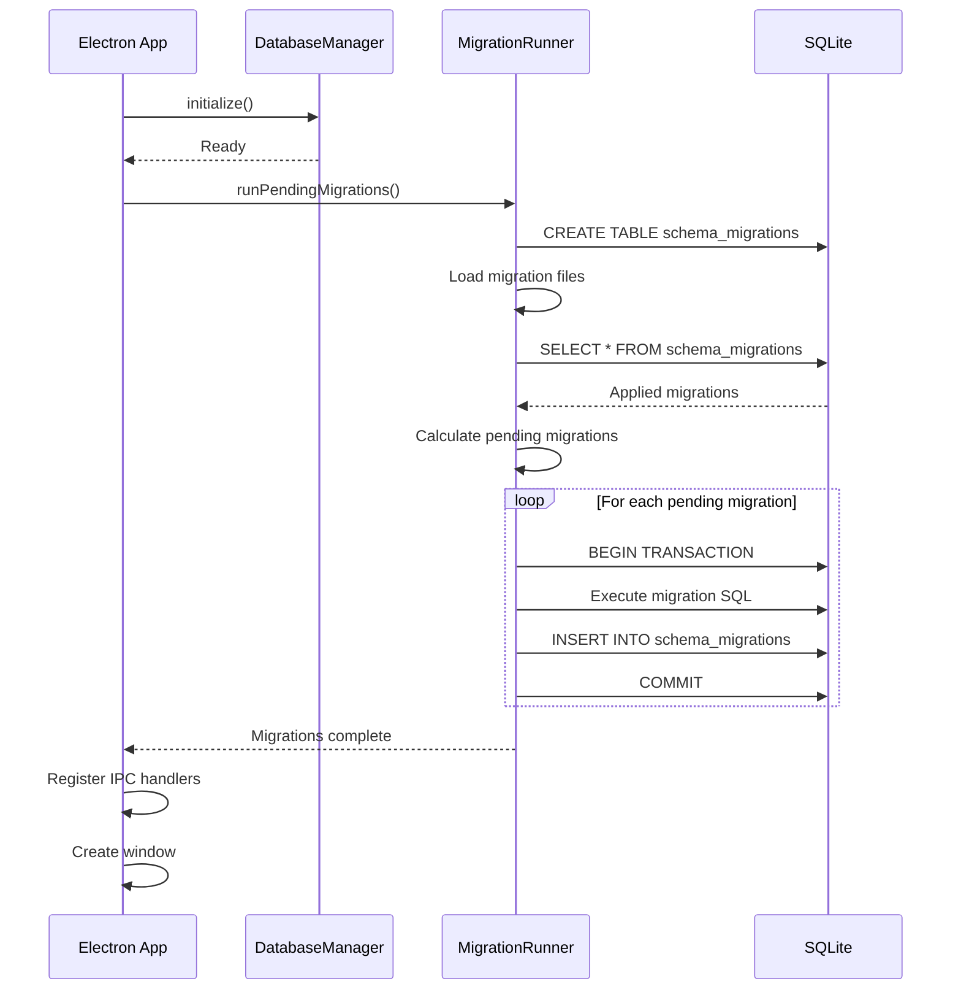

# Database Migration System

## Overview

The migration system provides safe, versioned schema changes with automatic tracking, checksums, and idempotent execution.

---

## Architecture

```
src/main/database/
├── index.ts                    # Database manager
├── migrations.ts               # Migration runner
└── migrations/
    ├── 000_schema_migrations.sql   # Migration tracking table
    ├── 001_initial_schema.sql      # Initial schema
    ├── 005_gst_percentage.sql      # GST basis pts -> percent (partially superseded by 011)
    ├── 011_paise_to_rupees.sql     # Full migration to Rupee storage
    └── ...
```

---

## Migration Tracking Table

**File:** `000_schema_migrations.sql`

```sql
CREATE TABLE IF NOT EXISTS schema_migrations (
  id INTEGER PRIMARY KEY AUTOINCREMENT,
  version INTEGER NOT NULL UNIQUE,
  name TEXT NOT NULL,
  applied_at TEXT NOT NULL DEFAULT (datetime('now')),
  checksum TEXT NOT NULL,
  execution_time_ms INTEGER NOT NULL
);
```

**Columns:**

- `version`: Migration number (1, 2, 3...)
- `name`: Human-readable name from filename
- `applied_at`: Timestamp when migration ran
- `checksum`: SHA-256 hash of SQL content
- `execution_time_ms`: Performance tracking

---

## File Naming Convention

**Format:** `{version}_{name}.sql`

**Examples:**

```
000_schema_migrations.sql    # Special: tracking table
001_initial_schema.sql       # First migration
005_gst_percentage.sql       # GST adjustment
011_paise_to_rupees.sql      # Currency standardization
```

**Rules:**

- ✅ Use 3-digit zero-padded version numbers (001, 002, 003)
- ✅ Use snake_case for names
- ✅ Be descriptive but concise
- ❌ Never modify a migration after it's been applied
- ❌ Never delete applied migrations

---

## Migration Runner Flow

### Startup Sequence



---

## Idempotent Execution

### How It Works

**1. Version Tracking:**

```typescript
// Check which migrations are already applied
const appliedVersions = new Set(db.prepare('SELECT version FROM schema_migrations').all());

// Only run migrations not in the set
const pending = allMigrations.filter((m) => !appliedVersions.has(m.version));
```

**2. Transactional Execution:**

```typescript
databaseManager.transaction(() => {
  // Run migration SQL
  db.exec(migration.sql);

  // Record in tracking table
  db.prepare(
    `
    INSERT INTO schema_migrations (version, name, checksum, execution_time_ms)
    VALUES (?, ?, ?, ?)
  `
  ).run(version, name, checksum, executionTime);
});
```

**Result:**

- ✅ Migration either fully succeeds or fully rolls back
- ✅ No partial application
- ✅ Safe to restart app mid-migration

**3. Checksum Verification:**

```typescript
const checksum = crypto.createHash('sha256').update(sql).digest('hex');

// On subsequent runs, verify checksum matches
if (current.checksum !== applied.checksum) {
  throw new Error('Migration file was modified after being applied!');
}
```

**Result:**

- ✅ Prevents accidental modification of applied migrations
- ✅ Detects tampering
- ✅ Ensures consistency across environments

---

## Creating New Migrations

### Step 1: Create SQL File

```bash
# Next version is 012
touch src/main/database/migrations/012_add_new_feature.sql
```

### Step 2: Write Migration SQL

```sql
-- Version: 012
-- Description: Add inventory tracking tables

CREATE TABLE IF NOT EXISTS inventory_adjustments (
  id INTEGER PRIMARY KEY AUTOINCREMENT,
  product_id INTEGER NOT NULL,
  quantity_change INTEGER NOT NULL,
  reason TEXT NOT NULL,
  created_at TEXT NOT NULL DEFAULT (datetime('now')),
  FOREIGN KEY (product_id) REFERENCES products(id) ON DELETE CASCADE
);

CREATE INDEX IF NOT EXISTS idx_inventory_adjustments_product_id
ON inventory_adjustments(product_id);
```

### Step 3: Test Migration

```bash
# Delete database to test from scratch
rm dev-data/smartkhata.db

# Run app - migrations will auto-apply
pnpm dev
```

### Step 4: Verify in Logs

```
[INFO] Running database migrations...
[INFO] Found 2 pending migration(s) { versions: [1, 2] }
[INFO] Running migration 1: initial_schema
[INFO] Migration 1 completed { executionTime: '15ms' }
[INFO] Running migration 2: add_inventory_tracking
[INFO] Migration 2 completed { executionTime: '8ms' }
[INFO] Database migrations completed
```

---

## Initial Schema (001)

**File:** `001_initial_schema.sql`

**Tables Created:**

1. **products**: Product catalog
2. **customers**: Customer records
3. **sales**: Sale transactions
4. **sale_items**: Line items for sales
5. **settings**: App configuration

**Key Features:**

- Foreign keys enabled
- Check constraints for data integrity
- Indexes for performance
- Default values for timestamps
- Soft deletes (`is_active`, `is_void`)

---

## Integration with App Startup

**File:** `src/main/index.ts`

```typescript
app.whenReady().then(async () => {
  // 1. Initialize database connection
  databaseManager.initialize();

  // 2. Run pending migrations
  await migrationRunner.runPendingMigrations();

  // 3. Now safe to use database
  registerIPCHandlers();
  createWindow();
});
```

**Error Handling:**

```typescript
try {
  await migrationRunner.runPendingMigrations();
} catch (error) {
  // Show error dialog
  dialog.showErrorBox('Database Migration Failed', ...);

  // Quit app (database is in unknown state)
  app.quit();
}
```

---

## Safety Features

### 1. Transactional Execution

- Each migration runs in a transaction
- All-or-nothing (no partial application)
- Automatic rollback on error

### 2. Checksum Verification

- SHA-256 hash of SQL content
- Prevents modification of applied migrations
- Detects file corruption

### 3. Version Ordering

- Migrations run in numerical order
- Gaps are allowed (001, 003, 005...)
- No duplicate versions allowed

### 4. Idempotent

- Safe to run multiple times
- Only pending migrations execute
- Already-applied migrations are skipped

### 5. Error Recovery

- Clear error messages
- Logs include version and name
- App quits on migration failure (safe state)

---

## Common Scenarios

### Scenario 1: Fresh Install

```
1. App starts
2. Database file doesn't exist
3. DatabaseManager creates empty database
4. MigrationRunner creates schema_migrations table
5. Runs migration 001 (initial schema)
6. App ready with full schema
```

### Scenario 2: App Update with New Migration

```
1. User updates app (v1.0 → v1.1)
2. New migration file: 002_add_feature.sql
3. App starts
4. MigrationRunner detects version 1 already applied
5. Runs only migration 002
6. App ready with updated schema
```

### Scenario 3: Migration Failure

```
1. Migration 002 has syntax error
2. Transaction begins
3. SQL execution fails
4. Transaction rolls back
5. schema_migrations unchanged
6. App shows error dialog and quits
7. User reports issue
8. Developer fixes migration
9. User restarts app
10. Migration 002 runs successfully
```

---

## Best Practices

### DO ✅

- Use descriptive migration names
- Add comments explaining complex changes
- Test migrations on a copy of production data
- Keep migrations small and focused
- Use `IF NOT EXISTS` for safety

### DON'T ❌

- Modify applied migrations
- Delete migration files
- Skip version numbers arbitrarily
- Put multiple features in one migration
- Forget to test rollback scenarios

---

## Debugging

### Check Current Version

```typescript
const version = migrationRunner.getCurrentVersion();
console.log('Current schema version:', version);
```

### Verify Integrity

```typescript
const isValid = migrationRunner.verifyMigrationIntegrity();
if (!isValid) {
  console.error('Migration files have been modified!');
}
```

### View Applied Migrations

```sql
SELECT version, name, applied_at, execution_time_ms
FROM schema_migrations
ORDER BY version ASC;
```

---

## Future Enhancements

### Rollback Support (Not Implemented)

```sql
-- 002_add_feature.up.sql
CREATE TABLE new_feature (...);

-- 002_add_feature.down.sql
DROP TABLE new_feature;
```

**Why Not Now?**

- Adds complexity
- Rarely needed for POS app
- Can be added later if required

---

## Summary

| Feature             | Status             | Benefit                     |
| ------------------- | ------------------ | --------------------------- |
| Version tracking    | ✅ Implemented     | Know current schema version |
| Checksums           | ✅ Implemented     | Prevent tampering           |
| Transactions        | ✅ Implemented     | All-or-nothing execution    |
| Idempotent          | ✅ Implemented     | Safe to retry               |
| Auto-run on startup | ✅ Implemented     | Zero manual steps           |
| Rollback            | ❌ Not implemented | Can add later if needed     |

---

**The migration system is production-ready and integrated into app startup!**
