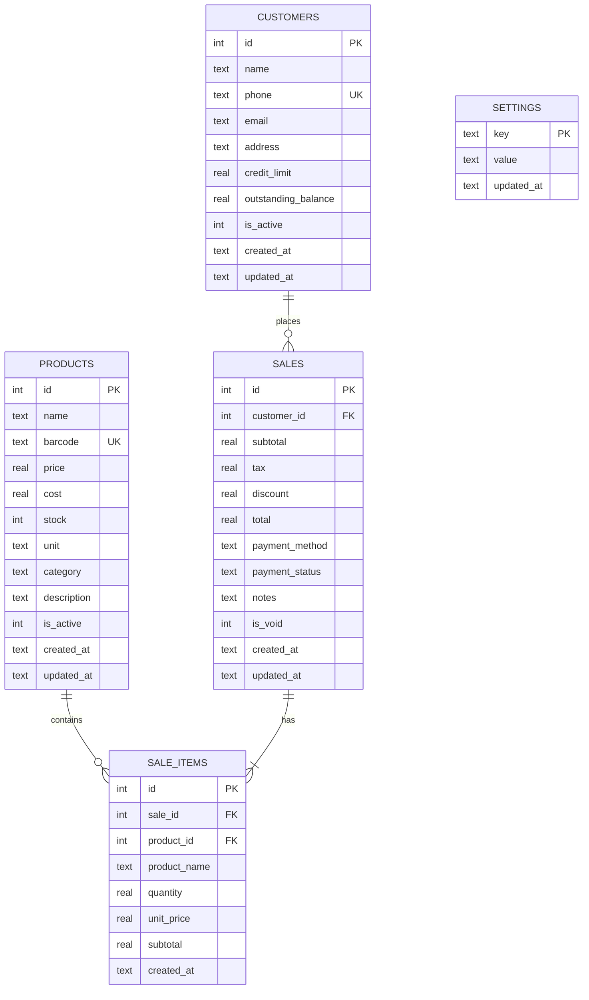

# Database Schema - Table Relationships

## Overview

The initial schema (`001_initial_schema.sql`) defines 5 core tables for the SmartKhata POS system.

---

## Entity Relationship Diagram



---

## Table Descriptions

### 1. `products`

**Purpose:** Product catalog with pricing and inventory

**Key Fields:**
- `id`: Auto-incrementing primary key
- `name`: Product name (required)
- `barcode`: Unique barcode (optional, for scanner support)
- `price`: Selling price (required, must be ≥ 0)
- `cost`: Cost price (optional, for profit tracking)
- `stock`: Current inventory count (default: 0)
- `unit`: Unit of measure (default: 'piece')
- `category`: Product category (optional, for filtering)
- `is_active`: Soft delete flag (1 = active, 0 = inactive)

**Indexes:**
- `barcode` - Fast barcode lookups
- `name` - Search by name
- `category` - Filter by category
- `is_active` - Filter active products

**Constraints:**
- `price >= 0`
- `cost >= 0` (if provided)
- `stock >= 0`
- `barcode` must be unique
- `is_active` must be 0 or 1

---

### 2. `customers`

**Purpose:** Customer records with credit tracking

**Key Fields:**
- `id`: Auto-incrementing primary key
- `name`: Customer name (required)
- `phone`: Phone number (unique, optional)
- `email`: Email address (optional)
- `address`: Physical address (optional)
- `credit_limit`: Maximum credit allowed (default: 0)
- `outstanding_balance`: Current unpaid amount (default: 0)
- `is_active`: Soft delete flag

**Indexes:**
- `phone` - Fast phone lookups
- `name` - Search by name
- `is_active` - Filter active customers

**Constraints:**
- `credit_limit >= 0`
- `phone` must be unique (if provided)
- `is_active` must be 0 or 1

---

### 3. `sales`

**Purpose:** Sale transactions (bills/invoices)

**Key Fields:**
- `id`: Auto-incrementing primary key
- `customer_id`: Foreign key to customers (optional)
- `subtotal`: Sum of line items (required, ≥ 0)
- `tax`: Tax amount (default: 0)
- `discount`: Discount amount (default: 0)
- `total`: Final amount (required, ≥ 0)
- `payment_method`: Payment type (default: 'cash')
- `payment_status`: Payment state ('paid', 'pending', 'partial')
- `notes`: Additional notes (optional)
- `is_void`: Cancellation flag (0 = valid, 1 = voided)

**Indexes:**
- `customer_id` - Find sales by customer
- `created_at` - Chronological queries
- `payment_status` - Filter unpaid sales
- `is_void` - Filter valid sales

**Constraints:**
- `subtotal >= 0`
- `tax >= 0`
- `discount >= 0`
- `total >= 0`
- `payment_status` must be 'paid', 'pending', or 'partial'
- `is_void` must be 0 or 1

**Foreign Keys:**
- `customer_id` → `customers(id)` ON DELETE SET NULL
  - If customer is deleted, sale remains but customer_id becomes NULL

---

### 4. `sale_items`

**Purpose:** Line items for each sale (products in a bill)

**Key Fields:**
- `id`: Auto-incrementing primary key
- `sale_id`: Foreign key to sales (required)
- `product_id`: Foreign key to products (required)
- `product_name`: Product name snapshot (required)
- `quantity`: Quantity sold (required, > 0)
- `unit_price`: Price at time of sale (required, ≥ 0)
- `subtotal`: Line total (quantity × unit_price)

**Indexes:**
- `sale_id` - Find items for a sale
- `product_id` - Find sales of a product

**Constraints:**
- `quantity > 0`
- `unit_price >= 0`
- `subtotal >= 0`

**Foreign Keys:**
- `sale_id` → `sales(id)` ON DELETE CASCADE
  - If sale is deleted, all line items are deleted
- `product_id` → `products(id)` ON DELETE RESTRICT
  - Cannot delete a product that has been sold

**Why Store `product_name`?**
- Historical accuracy: If product name changes, old receipts remain correct
- Performance: No need to join products table for receipt display

---

### 5. `settings`

**Purpose:** Application configuration (key-value store)

**Key Fields:**
- `key`: Setting name (primary key)
- `value`: Setting value (stored as text)
- `updated_at`: Last modification timestamp

**Default Settings:**
- `business_name`: "SmartKhata POS"
- `tax_rate`: "0" (percentage, e.g., "18" for 18%)
- `currency`: "INR"
- `receipt_footer`: "Thank you for your business!"

**No Foreign Keys:** Standalone configuration table

---

## Relationship Details

### One-to-Many Relationships

**1. Customer → Sales**
```
One customer can have many sales
One sale belongs to zero or one customer (optional)
```

**SQL:**
```sql
-- Get all sales for a customer
SELECT * FROM sales WHERE customer_id = ?;

-- Get customer for a sale
SELECT c.* FROM customers c
JOIN sales s ON s.customer_id = c.id
WHERE s.id = ?;
```

**2. Sale → Sale Items**
```
One sale has many sale items
One sale item belongs to exactly one sale
```

**SQL:**
```sql
-- Get all items for a sale
SELECT * FROM sale_items WHERE sale_id = ?;

-- Get sale for an item
SELECT s.* FROM sales s
JOIN sale_items si ON si.sale_id = s.id
WHERE si.id = ?;
```

**3. Product → Sale Items**
```
One product can appear in many sale items
One sale item references exactly one product
```

**SQL:**
```sql
-- Get all sales of a product
SELECT si.* FROM sale_items si
WHERE si.product_id = ?;

-- Get product for a sale item
SELECT p.* FROM products p
JOIN sale_items si ON si.product_id = p.id
WHERE si.id = ?;
```

---

## Foreign Key Behaviors

### ON DELETE SET NULL
```sql
FOREIGN KEY (customer_id) REFERENCES customers(id) ON DELETE SET NULL
```

**Scenario:** Customer is deleted
- Sales remain in database
- `customer_id` becomes NULL
- Historical data preserved

### ON DELETE CASCADE
```sql
FOREIGN KEY (sale_id) REFERENCES sales(id) ON DELETE CASCADE
```

**Scenario:** Sale is deleted
- All `sale_items` for that sale are automatically deleted
- Maintains referential integrity

### ON DELETE RESTRICT
```sql
FOREIGN KEY (product_id) REFERENCES products(id) ON DELETE RESTRICT
```

**Scenario:** Attempt to delete a product that has been sold
- Deletion fails with error
- Prevents data loss
- Use `is_active = 0` for soft delete instead

---

## Data Flow Example

### Creating a Sale

```sql
-- 1. Insert sale header
INSERT INTO sales (customer_id, subtotal, tax, discount, total, payment_method)
VALUES (5, 1000, 180, 50, 1130, 'cash');
-- Returns sale_id = 42

-- 2. Insert sale items
INSERT INTO sale_items (sale_id, product_id, product_name, quantity, unit_price, subtotal)
VALUES 
  (42, 10, 'Product A', 2, 300, 600),
  (42, 15, 'Product B', 1, 400, 400);

-- 3. Update product stock
UPDATE products SET stock = stock - 2 WHERE id = 10;
UPDATE products SET stock = stock - 1 WHERE id = 15;
```

---

## Extensibility

The schema is designed to be extended without breaking changes:

**Future Additions (via migrations):**
- `products.supplier_id` - Supplier tracking
- `sales.cashier_id` - User tracking
- `sale_items.discount` - Line-item discounts
- `payments` table - Multiple payment methods per sale
- `inventory_adjustments` - Stock tracking
- `categories` table - Normalize product categories

**Current Design Allows:**
- Adding columns without affecting existing queries
- Adding new tables without foreign key conflicts
- Soft deletes preserve historical data

---

## Summary

| Table | Purpose | Parent Tables | Child Tables |
|-------|---------|---------------|--------------|
| `products` | Product catalog | None | `sale_items` |
| `customers` | Customer records | None | `sales` |
| `sales` | Sale transactions | `customers` | `sale_items` |
| `sale_items` | Line items | `sales`, `products` | None |
| `settings` | Configuration | None | None |

**Total Tables:** 5  
**Total Foreign Keys:** 3  
**Total Indexes:** 13

---

**The schema is production-ready and follows SQLite best practices!**
