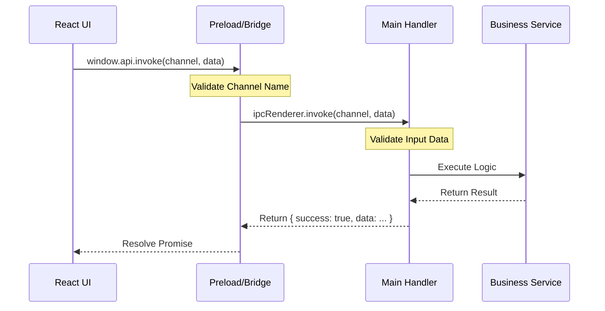

# IPC Architecture

## Overview

SmartKhata uses a **Request-Response** IPC architecture to communicate between the React Renderer and Electron Main process. This design enforces strict security boundaries and ensures type safety across the entire application.

## Core Principles

1.  **Renderer never accesses Node.js directly**: All system operations (filesystem, database) must go through IPC.
2.  **Request-Response Only**: We avoid `ipcRenderer.send()` (fire-and-forget). All calls use `invoke()` and return a promise.
3.  **Type Safety**: Shared TypeScript interfaces define all request and response payloads.
4.  **Centralized Validation**: All inputs are validated in the Main process before execution.

---

## Data Flow

---

## Components

### 1. Preload Bridge (`src/preload/index.ts`)

- **Role**: Secure gateway.
- **Function**: Exposes `window.api.invoke`.
- **Security**: Validates channel names against a whitelist before forwarding to Main.
- **Doc**: [PRELOAD_IPC_EXPOSURE.md](PRELOAD_IPC_EXPOSURE.md)

### 2. Channel Registry (`src/shared/ipc/channels.ts`)

- **Role**: Single source of truth for IPC channel names.
- **Function**: Defines constants like `PRODUCT_LIST`, `APP_VERSION`.
- **Doc**: [IPC_CHANNEL_REGISTRY.md](IPC_CHANNEL_REGISTRY.md)

### 3. IPC Handlers (`src/main/ipc/`)

- **Role**: Backend logic entry points.
- **Function**: Receives requests, validates inputs, calls services, returns `IPCResponse`.
- **Doc**: [IPC_HANDLER_FRAMEWORK.md](IPC_HANDLER_FRAMEWORK.md)

### 4. Shared Types (`src/shared/types/ipc.ts`)

- **Role**: Type definitions.
- **Function**: Ensures Renderer and Main agree on data structures.

---

## Developer Guide

### How to Add a New IPC Endpoint

1.  **Define Channel**: Add constant in `src/shared/ipc/channels.ts`.
2.  **Define Types**: Add Request/Response interfaces in `src/shared/types/ipc.ts`.
3.  **Implement Handler**: Create handler in `src/main/ipc/handlers/` using `IPCHandler.handle()`.
4.  **Register Handler**: Add to `registerIPCHandlers` in `src/main/ipc/index.ts`.
5.  **Call from React**: Use `window.api.invoke(NEW_CHANNEL, payload)`.

See [IPC_HANDLER_FRAMEWORK.md](IPC_HANDLER_FRAMEWORK.md) for detailed examples.

---

## Security Model

- **Context Isolation**: Enabled (`contextIsolation: true`).
- **Sandbox**: Disabled (for local file access without bundling), but `nodeIntegration` is `false`.
- **Channel Whitelisting**: Preload blocks unknown channels.
- **Error Sanitization**: Main process catches errors and returns friendly messages, never stack traces.

For details on request validation and security middleware, see **[SECURITY_AND_VALIDATION.md](SECURITY_AND_VALIDATION.md)**.

See [ELECTRON_SECURITY.md](ELECTRON_SECURITY.md) for details.
