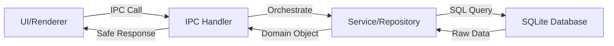

# IPC to Repository Wiring

## Overview

This document explains how **UI requests flow through IPC handlers to repositories and back**, with no SQL logic in the IPC layer.

---

## Data Flow Architecture



### Layer Responsibilities

| Layer | Responsibility | What It Does | What It Doesn't Do |
|-------|----------------|--------------|-------------------|
| **UI** | User interaction | Display data, collect input | SQL, business logic |
| **IPC Handler** | Orchestration | Call services/repos, format responses | SQL, complex logic |
| **Service** | Business logic | Validate, calculate, orchestrate repos | SQL |
| **Repository** | Data access | Execute SQL, map to domain objects | Business logic |
| **Database** | Storage | Store data, enforce constraints | Business logic |

---

## Safe Response Format

All IPC handlers return a **standardized response format**:

```typescript
interface IPCResponse<T> {
  success: boolean;
  data?: T;
  error?: string;
}
```

### Success Response

```typescript
{
  success: true,
  data: { /* actual data */ }
}
```

### Error Response

```typescript
{
  success: false,
  error: "User-friendly error message"
}
```

---

## Example 1: Product Creation

### UI → IPC → Repository → Database

**Step 1: UI calls IPC**
```typescript
// In renderer process
const result = await window.api.product.create({
  name: 'Coca Cola 500ml',
  barcode: '8901234567890',
  price: 40.00,
  gstPercent: 18,
  stock: 100
});

if (result.success) {
  console.log('Product created:', result.data);
} else {
  alert(result.error);
}
```

**Step 2: IPC Handler orchestrates**
```typescript
// In main process: product-handlers.ts
IPCHandler.handle<CreateProductRequest, IPCResponse<any>>(
  'product:create',
  async (request) => {
    try {
      // 1. Prepare input for repository
      const input: CreateProductInput = {
        name: request.name,
        salePrice: request.price,
        gstPercent: request.gstPercent || 18,
        stockQty: request.stock || 0
      };

      // 2. Call repository (NO SQL HERE)
      const product = productRepo.create(input);

      // 3. Return safe response
      return {
        success: true,
        data: {
          id: product.id,
          name: product.name,
          salePrice: product.salePrice,
          // ... convert domain object to plain object
        }
      };
    } catch (error) {
      // 4. Handle errors
      return {
        success: false,
        error: error.message
      };
    }
  }
);
```

**Step 3: Repository executes SQL**
```typescript
// In ProductRepository
public create(data: CreateProductInput): Product {
  const sql = `
    INSERT INTO products (name, sale_price, gst_percent, stock_qty)
    VALUES (?, ?, ?, ?)
  `;

  const result = this.execute(sql, [
    data.name,
    Math.round(data.salePrice * 100),  // Rupees → Paise
    Math.round(data.gstPercent * 100), // Percent → Basis points
    data.stockQty
  ]);

  return this.findById(result.lastInsertRowid)!;
}
```

**Step 4: Database stores data**
```
SQLite executes INSERT, returns lastInsertRowid
```

**Step 5: Response flows back**
```
Database → Repository (domain object) → IPC (plain object) → UI
```

---

## Example 2: Bill Creation (Complex Transaction)

### UI → IPC → Service → Repositories → Database

**Step 1: UI calls IPC**
```typescript
// In renderer process
const result = await window.api.bill.create({
  billNumber: 'BILL-20260208-0001',
  items: [
    { productId: 1, quantity: 2 },
    { productId: 4, quantity: 1 }
  ],
  paymentMode: 'cash'
});

if (result.success) {
  console.log('Bill created:', result.data.bill.billNumber);
  console.log('Items:', result.data.items.length);
} else {
  alert(result.error); // "Insufficient stock for Coca Cola..."
}
```

**Step 2: IPC Handler orchestrates**
```typescript
// In main process: bill-handlers.ts
IPCHandler.handle<CreateSaleInput, IPCResponse<any>>(
  'bill:create',
  async (saleData) => {
    try {
      // 1. Validate (optional pre-check)
      billingService.validateSale(saleData);

      // 2. Call service (NO SQL HERE)
      const result = billingService.createSale(saleData);

      // 3. Return safe response
      return {
        success: true,
        data: {
          bill: { /* bill data */ },
          items: [ /* items data */ ]
        }
      };
    } catch (error) {
      // 4. Handle specific errors
      if (error.message.includes('Insufficient stock')) {
        return {
          success: false,
          error: error.message
        };
      }
      return {
        success: false,
        error: 'Failed to create bill'
      };
    }
  }
);
```

**Step 3: Service orchestrates repositories**
```typescript
// In BillingTransactionService
public createSale(saleData: CreateSaleInput): BillWithItems {
  return this.transaction(() => {
    // 1. Validate and deduct stock
    saleData.items.forEach(item => {
      this.productRepo.updateStock(item.productId, -item.quantity);
    });

    // 2. Create bill
    const bill = this.billRepo.createBillWithItems(billData, billItems);

    // 3. Log inventory
    this.inventoryRepo.logChange({ /* ... */ });

    // 4. Update customer balance
    this.customerRepo.updateBalance(customerId, balanceChange);

    return bill;
  });
}
```

**Step 4: Repositories execute SQL**
```typescript
// Each repository executes its SQL
ProductRepository → UPDATE products SET stock_qty = ...
BillRepository → INSERT INTO bills ... + INSERT INTO bill_items ...
InventoryRepository → INSERT INTO inventory_logs ...
CustomerRepository → UPDATE customers SET balance_due = ...
```

**Step 5: Database processes transaction**
```
BEGIN TRANSACTION
  UPDATE products...
  INSERT INTO bills...
  INSERT INTO bill_items...
  INSERT INTO inventory_logs...
  UPDATE customers...
COMMIT (or ROLLBACK on error)
```

---

## Error Handling Flow

### Database Error → Repository → IPC → UI


**Example:**
```typescript
// Database throws UNIQUE constraint error
// ↓
// Repository catches and wraps
throw new DatabaseError('Record already exists', 'UNIQUE_VIOLATION', error);
// ↓
// IPC handler catches and formats
if (error.isCode('UNIQUE_VIOLATION')) {
  return {
    success: false,
    error: 'Product with this SKU already exists'
  };
}
// ↓
// UI displays to user
if (!result.success) {
  alert(result.error); // "Product with this SKU already exists"
}
```

---

## Key Principles

### 1. No SQL in IPC Handlers

```typescript
// ❌ BAD: SQL in IPC handler
IPCHandler.handle('product:create', async (data) => {
  const sql = `INSERT INTO products (name, price) VALUES (?, ?)`;
  db.execute(sql, [data.name, data.price]);
});

// ✅ GOOD: Call repository
IPCHandler.handle('product:create', async (data) => {
  const product = productRepo.create(data);
  return { success: true, data: product };
});
```

### 2. IPC Only Orchestrates

```typescript
// ❌ BAD: Business logic in IPC
IPCHandler.handle('bill:create', async (data) => {
  const subtotal = data.items.reduce((sum, item) => sum + item.price, 0);
  const gst = subtotal * 0.18;
  // ... complex calculation
});

// ✅ GOOD: Service handles logic
IPCHandler.handle('bill:create', async (data) => {
  const result = billingService.createSale(data);
  return { success: true, data: result };
});
```

### 3. Safe Response Format

```typescript
// ❌ BAD: Throw errors to renderer
IPCHandler.handle('product:get', async (id) => {
  const product = productRepo.findById(id);
  if (!product) throw new Error('Not found');
  return product;
});

// ✅ GOOD: Return safe response
IPCHandler.handle('product:get', async (id) => {
  try {
    const product = productRepo.findById(id);
    if (!product) {
      return { success: false, error: 'Product not found' };
    }
    return { success: true, data: product };
  } catch (error) {
    return { success: false, error: error.message };
  }
});
```

### 4. Convert Domain Objects

```typescript
// ❌ BAD: Return domain objects directly
return {
  success: true,
  data: product // Contains Date objects, methods, etc.
};

// ✅ GOOD: Convert to plain objects
return {
  success: true,
  data: {
    id: product.id,
    name: product.name,
    createdAt: product.createdAt.toISOString() // Date → string
  }
};
```

---

## Complete Flow Example

### Product List Request

```
┌─────────────────────────────────────────────────────────────┐
│ 1. UI (Renderer Process)                                    │
│    window.api.product.list()                                │
└─────────────────────────────────────────────────────────────┘
                            ↓
┌─────────────────────────────────────────────────────────────┐
│ 2. IPC Handler (Main Process)                               │
│    IPCHandler.handle('product:list', async () => {          │
│      const products = productRepo.findAll();                │
│      return { success: true, data: products };              │
│    })                                                        │
└─────────────────────────────────────────────────────────────┘
                            ↓
┌─────────────────────────────────────────────────────────────┐
│ 3. Repository (Main Process)                                │
│    ProductRepository.findAll() {                            │
│      const sql = "SELECT * FROM products WHERE is_active=1";│
│      const rows = this.queryAll(sql);                       │
│      return rows.map(row => this._mapToProduct(row));       │
│    }                                                         │
└─────────────────────────────────────────────────────────────┘
                            ↓
┌─────────────────────────────────────────────────────────────┐
│ 4. Database (SQLite)                                         │
│    Executes: SELECT * FROM products WHERE is_active = 1     │
│    Returns: [{id:1, name:'...', sale_price:4000, ...}, ...] │
└─────────────────────────────────────────────────────────────┘
                            ↓
┌─────────────────────────────────────────────────────────────┐
│ 5. Repository Maps to Domain Objects                        │
│    [{id:1, name:'...', salePrice:40.00, ...}, ...]          │
│    (Paise → Rupees, INTEGER → boolean, TEXT → Date)         │
└─────────────────────────────────────────────────────────────┘
                            ↓
┌─────────────────────────────────────────────────────────────┐
│ 6. IPC Handler Converts to Plain Objects                    │
│    {success: true, data: [{id:1, name:'...', ...}, ...]}    │
└─────────────────────────────────────────────────────────────┘
                            ↓
┌─────────────────────────────────────────────────────────────┐
│ 7. UI Receives Response                                      │
│    if (result.success) {                                     │
│      displayProducts(result.data);                           │
│    }                                                          │
└─────────────────────────────────────────────────────────────┘
```

---

## Summary

**IPC Handler Responsibilities:**
- ✅ Validate input (schema validation)
- ✅ Call services/repositories
- ✅ Format responses (safe response format)
- ✅ Handle errors (user-friendly messages)
- ❌ NO SQL queries
- ❌ NO business logic
- ❌ NO direct database access

**This architecture ensures clean separation of concerns and maintainable code!**
