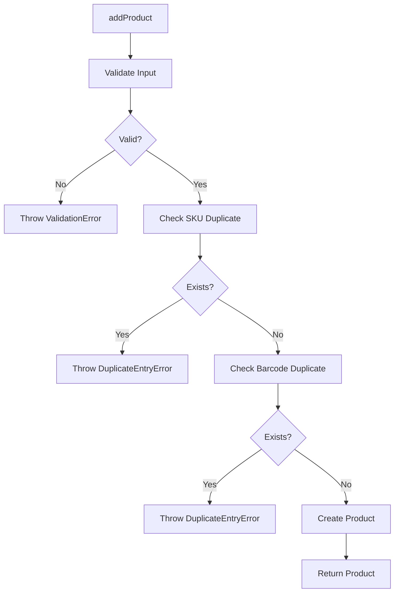
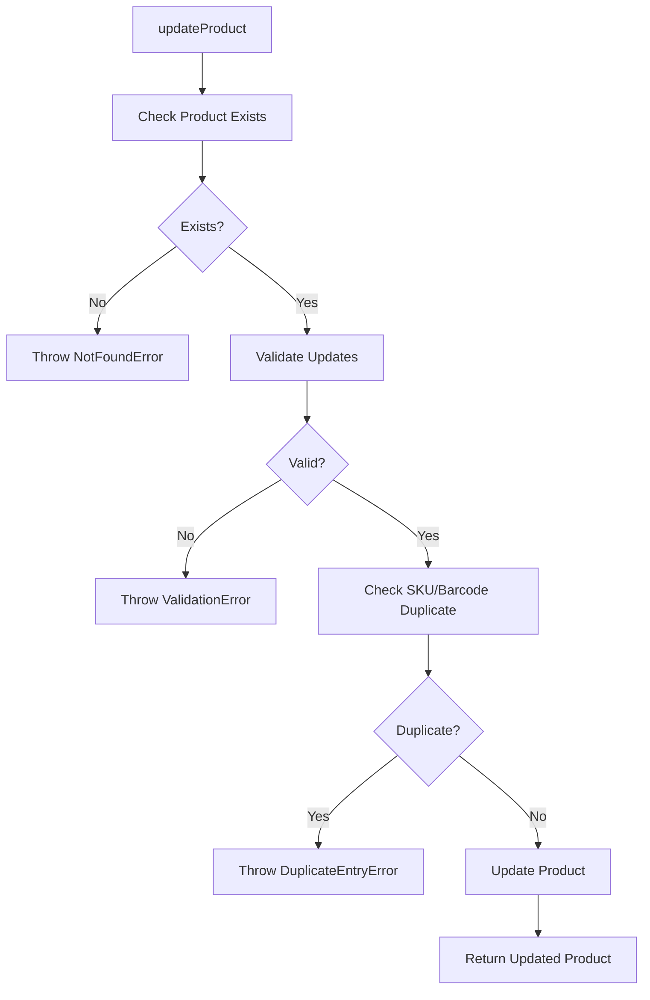
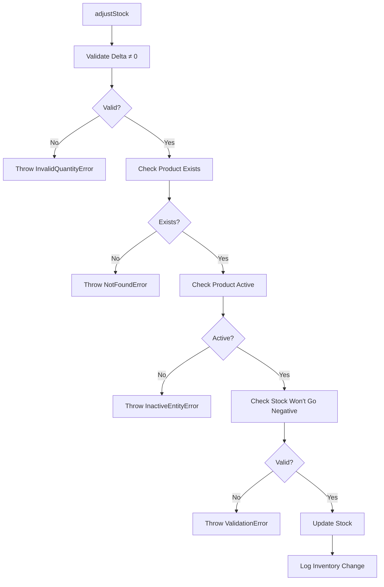

# ProductService Validation Rules

## Overview

The `ProductService` enforces **business validation rules** for product management, preventing invalid data and duplicate entries.

---

## Validation Rules

### 1. Product Name

| Rule | Validation | Error |
|------|------------|-------|
| **Required** | Name cannot be empty | `ValidationError: Product name is required` |
| **Max Length** | ≤ 200 characters | `ValidationError: Product name is too long` |

**Examples:**
```typescript
✅ "Coca Cola 500ml"
✅ "Amul Milk 1L"
❌ "" (empty)
❌ "A".repeat(201) (too long)
```

---

### 2. Sale Price

| Rule | Validation | Error |
|------|------------|-------|
| **Required** | Must be provided | `ValidationError: Sale price is required` |
| **Positive** | > 0 | `ValidationError: Sale price must be positive` |
| **Max Value** | ≤ ₹10,00,000 | `ValidationError: Sale price is too high` |

**Examples:**
```typescript
✅ 40.00
✅ 150.50
❌ 0 (not positive)
❌ -10 (negative)
❌ 1500000 (too high)
```

---

### 3. Purchase Price

| Rule | Validation | Error |
|------|------------|-------|
| **Optional** | Can be null/undefined | - |
| **Non-negative** | ≥ 0 | `ValidationError: Purchase price cannot be negative` |

**Examples:**
```typescript
✅ 30.00
✅ undefined (optional)
❌ -5 (negative)
```

---

### 4. GST Percent

| Rule | Validation | Error |
|------|------------|-------|
| **Optional** | Defaults to 18% | - |
| **Range** | 0 ≤ GST ≤ 100 | `ValidationError: GST percent must be between 0 and 100` |

**Examples:**
```typescript
✅ 18 (default)
✅ 5
✅ 0 (no GST)
❌ -5 (negative)
❌ 150 (too high)
```

---

### 5. Stock Quantity

| Rule | Validation | Error |
|------|------------|-------|
| **Optional** | Defaults to 0 | - |
| **Non-negative** | ≥ 0 | `ValidationError: Stock quantity cannot be negative` |

**Examples:**
```typescript
✅ 100
✅ 0 (default)
❌ -10 (negative)
```

---

### 6. SKU (Stock Keeping Unit)

| Rule | Validation | Error |
|------|------------|-------|
| **Optional** | Can be null/undefined | - |
| **Unique** | No duplicate SKU | `DuplicateEntryError: Product with SKU 'ABC123' already exists` |
| **Max Length** | ≤ 50 characters | `ValidationError: SKU is too long` |

**Examples:**
```typescript
✅ "COKE-500"
✅ undefined (optional)
❌ "ABC123" (if already exists)
❌ "A".repeat(51) (too long)
```

---

### 7. Barcode

| Rule | Validation | Error |
|------|------------|-------|
| **Optional** | Can be null/undefined | - |
| **Unique** | No duplicate barcode | `DuplicateEntryError: Product with barcode '8901234567890' already exists` |
| **Max Length** | ≤ 50 characters | `ValidationError: Barcode is too long` |

**Examples:**
```typescript
✅ "8901234567890"
✅ undefined (optional)
❌ "8901234567890" (if already exists)
❌ "1".repeat(51) (too long)
```

---

### 8. Low Stock Alert

| Rule | Validation | Error |
|------|------------|-------|
| **Optional** | Can be null/undefined | - |
| **Non-negative** | ≥ 0 | `ValidationError: Low stock alert cannot be negative` |

**Examples:**
```typescript
✅ 10
✅ undefined (optional)
❌ -5 (negative)
```

---

## Stock Adjustment Validation

### Delta Quantity

| Rule | Validation | Error |
|------|------------|-------|
| **Non-zero** | ≠ 0 | `InvalidQuantityError: Stock adjustment cannot be zero` |
| **No negative stock** | Current stock + delta ≥ 0 | `ValidationError: Cannot deduct X units. Only Y available.` |

**Examples:**
```typescript
// Current stock: 50
✅ +100 (add 100 units)
✅ -30 (deduct 30 units)
❌ 0 (no change)
❌ -60 (would result in -10 stock)
```

---

## Duplicate Prevention

### How It Works

**Before creating/updating a product:**
1. Check if SKU already exists (if provided)
2. Check if barcode already exists (if provided)
3. Throw `DuplicateEntryError` if found

**Example:**
```typescript
// Existing product: SKU = "COKE-500"

// Try to create new product with same SKU
productService.addProduct({
  name: 'Pepsi 500ml',
  sku: 'COKE-500',  // Duplicate!
  salePrice: 40
});

// Throws: DuplicateEntryError: Product with SKU 'COKE-500' already exists
```

---

## Business Rules

### 1. Inactive Products

**Rule:** Cannot adjust stock for inactive products

```typescript
// Product is inactive (isActive = false)
productService.adjustStock({
  productId: 1,
  deltaQty: 10,
  reason: 'MANUAL'
});

// Throws: InactiveEntityError: Cannot use inactive Product
```

---

### 2. Margin Calculation

**Formula:**
```
Margin % = ((Sale Price - Purchase Price) / Sale Price) × 100
```

**Example:**
```typescript
// Sale Price: ₹100, Purchase Price: ₹70
const margin = productService.calculateMargin(productId);
// Returns: 30.00 (30% margin)
```

**Edge Cases:**
- No purchase price → Returns 0
- Purchase price = 0 → Returns 0

---

## Validation Flow

### Add Product Flow



### Update Product Flow



### Stock Adjustment Flow



---

## Error Examples

### Validation Errors

```typescript
// Empty name
productService.addProduct({ name: '', salePrice: 100 });
// → ValidationError: Product name is required

// Negative price
productService.addProduct({ name: 'Test', salePrice: -10 });
// → ValidationError: Sale price must be positive

// Invalid GST
productService.addProduct({ name: 'Test', salePrice: 100, gstPercent: 150 });
// → ValidationError: GST percent must be between 0 and 100
```

### Duplicate Errors

```typescript
// Duplicate SKU
productService.addProduct({ name: 'Product A', sku: 'ABC123', salePrice: 100 });
productService.addProduct({ name: 'Product B', sku: 'ABC123', salePrice: 200 });
// → DuplicateEntryError: Product with SKU 'ABC123' already exists
```

### Business Errors

```typescript
// Insufficient stock
productService.adjustStock({ productId: 1, deltaQty: -100, reason: 'MANUAL' });
// Current stock: 50
// → ValidationError: Cannot deduct 100 units. Only 50 available.

// Inactive product
productService.adjustStock({ productId: 2, deltaQty: 10, reason: 'MANUAL' });
// Product 2 is inactive
// → InactiveEntityError: Cannot use inactive Product
```

---

## Summary

**ProductService Validation:**
- ✅ Input validation (required fields, ranges, formats)
- ✅ Duplicate prevention (SKU, barcode)
- ✅ Business rules (active status, stock limits)
- ✅ Typed errors (ValidationError, DuplicateEntryError, etc.)

**This ensures data integrity and prevents invalid product data!**
