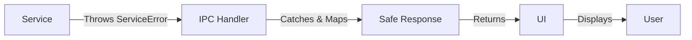

# Service Error Flow

## Overview

This document explains how **errors flow from services to IPC to UI**, with proper error handling and user-friendly messages.

---

## Error Class Hierarchy

```
ServiceError (abstract base)
├── ValidationError
│   └── InvalidQuantityError
├── BusinessError
│   ├── InsufficientStockError
│   ├── DuplicateEntryError
│   ├── InactiveEntityError
│   ├── CreditLimitExceededError
│   └── LicenseError
└── NotFoundError
```

---

## Error Flow Architecture



---

## Error Properties

### ServiceError Base Class

```typescript
abstract class ServiceError extends Error {
  code: string;              // Error code (e.g., 'INSUFFICIENT_STOCK')
  isOperational: boolean;    // true = expected error, false = bug
  getUserMessage(): string;  // User-friendly message
}
```

### Example: InsufficientStockError

```typescript
class InsufficientStockError extends BusinessError {
  productId: number;
  productName: string;
  available: number;
  required: number;
  
  getUserMessage(): string {
    return `Not enough stock for ${this.productName}. Only ${this.available} available.`;
  }
}
```

---

## Step-by-Step Error Flow

### Step 1: Service Throws Typed Error

```typescript
// In ProductService
public deductStock(productId: number, quantity: number): void {
  const product = this.productRepo.findById(productId);
  
  if (!product) {
    throw new NotFoundError('Product', productId);
  }

  if (product.stockQty < quantity) {
    throw new InsufficientStockError(
      product.id,
      product.name,
      product.stockQty,
      quantity
    );
  }

  this.productRepo.updateStock(productId, -quantity);
}
```

### Step 2: IPC Handler Catches Error

```typescript
// In IPC handler
IPCHandler.handle('product:deductStock', async (data) => {
  try {
    const productService = new ProductService();
    productService.deductStock(data.productId, data.quantity);
    
    return {
      success: true,
      data: null
    };
  } catch (error) {
    // Handle specific errors
    if (error instanceof InsufficientStockError) {
      return {
        success: false,
        error: error.getUserMessage(),
        errorCode: error.code,
        context: {
          available: error.available,
          required: error.required
        }
      };
    }

    if (error instanceof NotFoundError) {
      return {
        success: false,
        error: 'Product not found',
        errorCode: error.code
      };
    }

    // Generic error
    return {
      success: false,
      error: getUserFriendlyMessage(error),
      errorCode: 'UNKNOWN_ERROR'
    };
  }
});
```

### Step 3: UI Displays Error

```typescript
// In UI
const result = await window.api.product.deductStock({
  productId: 1,
  quantity: 100
});

if (!result.success) {
  // Display user-friendly error
  alert(result.error); // "Not enough stock for Coca Cola. Only 50 available."
  
  // Optional: Handle specific error codes
  if (result.errorCode === 'INSUFFICIENT_STOCK') {
    showStockWarning(result.context.available, result.context.required);
  }
}
```

---

## Error Mapping Examples

### Example 1: Validation Error

```typescript
// Service throws
throw new ValidationError('Quantity must be positive', 'quantity', -5);

// IPC catches
if (error instanceof ValidationError) {
  return {
    success: false,
    error: error.getUserMessage(), // "Invalid quantity: Quantity must be positive"
    errorCode: 'VALIDATION_ERROR',
    field: error.field
  };
}

// UI displays
alert(result.error);
highlightField(result.field); // Highlight 'quantity' field
```

### Example 2: Business Error

```typescript
// Service throws
throw new CreditLimitExceededError(
  customerId: 1,
  currentBalance: 5000,
  creditLimit: 10000,
  attemptedAmount: 6000
);

// IPC catches
if (error instanceof CreditLimitExceededError) {
  return {
    success: false,
    error: error.getUserMessage(), // "Customer credit limit exceeded..."
    errorCode: 'CREDIT_LIMIT_EXCEEDED',
    context: {
      currentBalance: error.currentBalance,
      creditLimit: error.creditLimit
    }
  };
}

// UI displays
alert(result.error);
showCreditLimitDialog(result.context);
```

### Example 3: Not Found Error

```typescript
// Service throws
throw new NotFoundError('Customer', 123);

// IPC catches
if (error instanceof NotFoundError) {
  return {
    success: false,
    error: error.getUserMessage(), // "Customer not found"
    errorCode: 'NOT_FOUND'
  };
}

// UI displays
alert(result.error);
```

---

## User-Friendly Message Mapping

### Technical Message → User Message

| Technical Message | User-Friendly Message |
|-------------------|----------------------|
| `Product with SKU 'ABC123' already exists` | `This SKU is already in use` |
| `Insufficient stock. Available: 5, Required: 10` | `Not enough stock for Coca Cola. Only 5 available.` |
| `Cannot use inactive product` | `This product is inactive and cannot be used` |
| `Credit limit exceeded. Current: ₹5000, Limit: ₹10000` | `Customer credit limit exceeded. Current balance: ₹5000` |

### Implementation

```typescript
class InsufficientStockError extends BusinessError {
  // Technical message (for logs)
  constructor(productId, productName, available, required) {
    super(
      `Insufficient stock for ${productName}. Available: ${available}, Required: ${required}`,
      'INSUFFICIENT_STOCK'
    );
  }

  // User-friendly message (for UI)
  getUserMessage(): string {
    return `Not enough stock for ${this.productName}. Only ${this.available} available.`;
  }
}
```

---

## Error Context

Errors can include **context data** for UI handling:

```typescript
throw new InsufficientStockError(
  productId: 1,
  productName: 'Coca Cola',
  available: 5,
  required: 10
);

// IPC returns
{
  success: false,
  error: "Not enough stock for Coca Cola. Only 5 available.",
  errorCode: "INSUFFICIENT_STOCK",
  context: {
    productId: 1,
    productName: "Coca Cola",
    available: 5,
    required: 10
  }
}

// UI can use context
if (result.errorCode === 'INSUFFICIENT_STOCK') {
  showStockDialog({
    product: result.context.productName,
    available: result.context.available,
    required: result.context.required
  });
}
```

---

## Complete Example

### Service Layer

```typescript
export class SaleService extends BaseService {
  public createSale(saleData: CreateSaleInput): BillWithItems {
    // Validation
    if (!saleData.items || saleData.items.length === 0) {
      throw new ValidationError('Sale must have at least one item', 'items');
    }

    // Business rule check
    saleData.items.forEach(item => {
      const product = this.productRepo.findById(item.productId);
      
      if (!product) {
        throw new NotFoundError('Product', item.productId);
      }

      if (!product.isActive) {
        throw new InactiveEntityError('Product', product.id);
      }

      if (product.stockQty < item.quantity) {
        throw new InsufficientStockError(
          product.id,
          product.name,
          product.stockQty,
          item.quantity
        );
      }
    });

    // Create sale
    return this.billingService.createSale(saleData);
  }
}
```

### IPC Handler

```typescript
IPCHandler.handle('sale:create', async (saleData) => {
  try {
    const saleService = new SaleService();
    const result = saleService.createSale(saleData);
    
    return {
      success: true,
      data: result
    };
  } catch (error) {
    // Handle specific errors
    if (error instanceof ValidationError) {
      return {
        success: false,
        error: error.getUserMessage(),
        errorCode: error.code,
        field: error.field
      };
    }

    if (error instanceof InsufficientStockError) {
      return {
        success: false,
        error: error.getUserMessage(),
        errorCode: error.code,
        context: {
          productName: error.productName,
          available: error.available,
          required: error.required
        }
      };
    }

    if (error instanceof NotFoundError) {
      return {
        success: false,
        error: error.getUserMessage(),
        errorCode: error.code
      };
    }

    // Generic error
    this.logError('Sale creation failed', error);
    return {
      success: false,
      error: 'Failed to create sale',
      errorCode: 'UNKNOWN_ERROR'
    };
  }
});
```

### UI Layer

```typescript
async function createSale(saleData) {
  const result = await window.api.sale.create(saleData);
  
  if (!result.success) {
    // Display error
    alert(result.error);
    
    // Handle specific errors
    switch (result.errorCode) {
      case 'INSUFFICIENT_STOCK':
        showStockWarning(result.context);
        break;
      case 'VALIDATION_ERROR':
        highlightField(result.field);
        break;
      case 'NOT_FOUND':
        showNotFoundDialog();
        break;
    }
    
    return;
  }
  
  // Success
  console.log('Sale created:', result.data);
}
```

---

## Benefits

| Benefit | Description |
|---------|-------------|
| **Type Safety** | Typed errors with context |
| **User-Friendly** | Clear messages for users |
| **Debuggable** | Technical details in logs |
| **Actionable** | UI can handle specific errors |
| **Consistent** | Standard error format |

---

## Summary

**Error Flow:**
1. ✅ Service throws typed `ServiceError`
2. ✅ IPC handler catches and maps to safe response
3. ✅ UI displays user-friendly message
4. ✅ Optional: UI handles specific error codes

**This provides robust error handling with great UX!**
