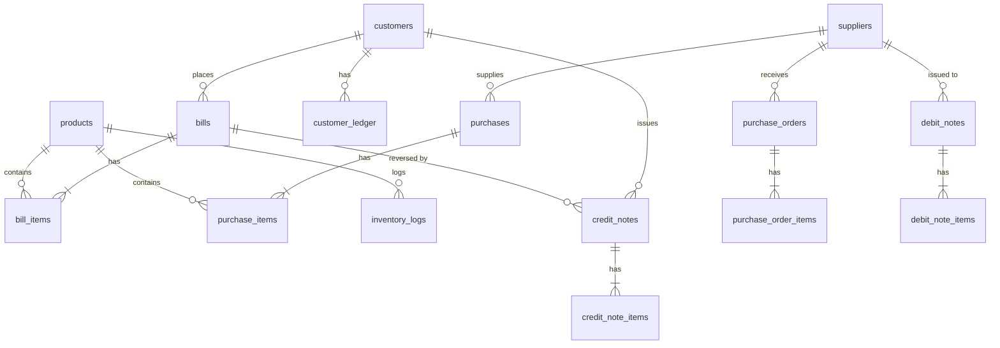

# Database Schema & Persistence Architecture

SmartKhata uses a high-performance, local-first SQLite engine managed via a strict migration-based schema. This document details the tables, relationships, indexing strategy, and physical optimizations.

---

## 1. Physical Optimization Layer

To ensure "Kirana-Speed" performance even on low-end retail hardware (HDDs/Slow SSDs), SmartKhata applies several PRAGMA optimizations:

- **Journal Mode**: `WAL` (Write-Ahead Logging). Allows concurrent reads and writes, preventing UI hangs during heavy backup or report generation tasks.
- **Synchronous**: `NORMAL`. Balances data safety with write speed.
- **Cache Size**: `2000` pages (~128MB). Keeps hot items and recent bills in memory for sub-millisecond lookups.
- **Auto-Vacuum**: `INCREMENTAL`. Periodically reclaims space from deleted logs/bills without blocking the main thread.

---

## 2. The Great Migration (Paise to Rupees)

Initially (Migration 001-010), SmartKhata stored money as `INTEGER` (Paise) to avoid floating-point errors. 
- **Change**: Migration 011 converted all financial columns to `REAL` (Rupees).
- **Reasoning**: To simplify cross-process math and align with 3rd-party GST reporting libraries that expect standard decimal formats.
- **Accuracy Guard**: The `BaseRepository` and `KiranaService` enforce manual rounding to 2 or 3 decimal places to prevent binary floating-point drift.

---

## 3. Indexing Strategy (Search Performance)

SmartKhata maintains a lean indexing footprint to ensure `INSERT` operations (Billing) remain fast while `SELECT` operations (Search/Reports) are optimized.

| Table | Index Columns | Purpose |
|-------|---------------|---------|
| **products** | `name`, `sku`, `barcode` | Instant lookup during barcode scan or type-ahead search. |
| **products** | `is_active`, `drug_category` | High-speed filtering for Medical Mode compliance and active inventory. |
| **bills** | `bill_number`, `created_at` | Rapid retrieval of historical records and date-range reporting. |
| **customers** | `phone`, `name` | Primary lookup for loyalty and credit ledger mapping. |
| **inventory_logs**| `product_id`, `created_at` | Optimized for "Product History" and stock audit trails. |
| **suppliers** | `name`, `phone` | Procurement and accounts payable search. |

---

## 4. Entity Relationship Diagram

---

## 5. Table Dictionary (Detailed)

### Inventory & Catalog
- **`products`**: Master catalog. Includes `salt_name`, `strip_size`, `expiry_date` (Medical) and `is_weight_based` (Kirana).
- **`inventory_logs`**: Atomic ledger of every piece moved. `reason` column tracks 'SALE', 'PURCHASE', 'RETURN', or 'ADJUSTMENT'.

### Sales & Revenue
- **`bills`**: B2C/B2B sale headers. Stores `subtotal`, `gst_total`, and `grand_total`.
- **`bill_items`**: Line items with `product_name_snapshot` and `hsn_snapshot` to preserve historical record integrity if a product's master record is changed later.
- **`credit_notes`**: Handles sales returns and reversed GST liabilities.

### Procurement & Payables
- **`purchases`**: Inward stock invoices (Input Tax Credit source).
- **`suppliers`**: Vendor profiles with `balance_due` persistence.
- **`purchase_orders`**: Planning documents for future stock intake (No inventory impact).
- **`debit_notes`**: Purchase returns to vendors.

---

## Technical Reference
- **Engine**: SQLite 3 (better-sqlite3)
- **Migrations Path**: `src/main/database/migrations`
- **Logic Wrapper**: `src/main/repositories/base-repository.ts`
