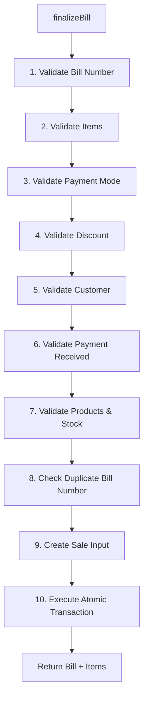

# BillingService Flow

## Overview

The `BillingService` is the **single source of truth** for billing business logic. It calculates totals, validates inputs, and orchestrates the atomic billing transaction.

---

## Architecture

```
BillingService (business logic)
    ↓
BillingTransactionService (atomic transaction)
    ↓
Repositories (data access)
```

---

## Two-Phase Billing Flow

### Phase 1: Calculate (Preview)

**Purpose:** Show user the bill preview instantly before finalizing (using renderer-side `calculateBillPreview` in `src/renderer/utils/billing-math.ts` for 0-latency).

> [!NOTE]
> Complex logic like percentage-to-fixed discount conversion is performed in the renderer to ensure instant UI feedback. The main process receives the final fixed discount amount for record-keeping.

```typescript
const calculation = billingService.calculateBill(items, discountAmount);

// Returns:
{
  items: [
    {
      productId: 1,
      productName: "Coca Cola 500ml",
      quantity: 2,
      unitPrice: 40.00,
      gstPercent: 18.00,
      lineSubtotal: 80.00,
      lineGst: 14.40,
      lineTotal: 94.40
    }
  ],
  subtotal: 80.00,
  gstTotal: 14.40,
  discountAmount: 0,
  grandTotal: 94.40
}
```

**What it does:**

- ✅ Validates items exist
- ✅ Calculates line totals
- ✅ Calculates subtotal, GST, grand total
- ❌ Does NOT create bill
- ❌ Does NOT deduct stock
- ❌ Does NOT start transaction

---

### Phase 2: Finalize (Commit)

**Purpose:** Create bill and execute atomic transaction

```typescript
const result = billingService.finalizeBill({
  billNumber: 'BILL-20260208-0001',
  items: [{ productId: 1, quantity: 2 }],
  paymentMode: 'cash'
});

// Returns:
{
  bill: { id, billNumber, grandTotal, ... },
  items: [ { id, productId, quantity, ... } ]
}
```

**What it does:**

- ✅ Validates all inputs
- ✅ Checks stock availability
- ✅ Checks duplicate bill number
- ✅ Creates bill atomically
- ✅ Deducts stock
- ✅ Logs inventory
- ✅ Updates customer balance

---

## Step-by-Step Finalize Flow



---

## Detailed Step Breakdown

### Step 1: Validate Bill Number

```typescript
// Check required
if (!billNumber || billNumber.trim() === '') {
  throw new ValidationError('Bill number is required');
}

// Check length
if (billNumber.length > 50) {
  throw new ValidationError('Bill number is too long');
}
```

---

### Step 2: Validate Items

```typescript
// Check items exist
if (!items || items.length === 0) {
  throw new ValidationError('Bill must have at least one item');
}
```

---

### Step 3: Validate Payment Mode

```typescript
// Check valid payment mode
const validModes = ['cash', 'upi', 'mixed'];
if (!validModes.includes(paymentMode)) {
  throw new ValidationError('Invalid payment mode');
}
```

---

### Step 4: Validate Discount

```typescript
// Check discount is non-negative
if (discountAmount && discountAmount < 0) {
  throw new ValidationError('Discount cannot be negative');
}
```

---

### Step 5: Validate Customer (if provided)

```typescript
if (customerId) {
  const customer = customerRepo.findById(customerId);

  if (!customer) {
    throw new NotFoundError('Customer', customerId);
  }

  if (!customer.isActive) {
    throw new InactiveEntityError('Customer', customerId);
  }
}
```

---

### Step 6: Validate Payment Received

```typescript
if (paymentReceived !== undefined && paymentReceived < 0) {
  throw new ValidationError('Payment received cannot be negative');
}
```

---

### Step 7: Validate Products & Stock

```typescript
items.forEach((item) => {
  // Validate quantity
  if (item.quantity <= 0) {
    throw new InvalidQuantityError('Quantity must be positive');
  }

  // Get product
  const product = productRepo.findById(item.productId);
  if (!product) {
    throw new NotFoundError('Product', item.productId);
  }

  if (!product.isActive) {
    throw new InactiveEntityError('Product', item.productId);
  }

  // Check stock availability
  if (product.stockQty < item.quantity) {
    throw new InsufficientStockError(product.id, product.name, product.stockQty, item.quantity);
  }
});
```

---

### Step 8: Check Duplicate Bill Number

```typescript
const existingBill = billRepo.findByBillNumber(billNumber);
if (existingBill) {
  throw new DuplicateEntryError('Bill', 'bill number', billNumber);
}
```

---

### Step 9: Create Sale Input

```typescript
const saleInput: CreateSaleInput = {
  billNumber,
  customerId,
  items: items.map((item) => ({
    productId: item.productId,
    quantity: item.quantity,
  })),
  paymentMode,
  paymentReceived,
  discountAmount: discountAmount || 0,
};
```

---

### Step 10: Execute Atomic Transaction

```typescript
const result = transactionService.createSale(saleInput);

// Transaction does:
// 1. Create bill + items
// 2. Deduct stock
// 3. Log inventory
// 4. Update customer balance
// All in ONE atomic transaction
```

---

## Calculation Logic

### Line Item Calculation (B2C vs B2B)

SmartKhata supports both **Inclusive** (B2C MRP) and **Exclusive** (B2B Wholesaler) GST calculations, evaluated natively per-item during the transaction flow.

```typescript
// 1. Determine tax mode based on Global Settings OR Product Settings
const isGstInclusive = settings.gstExclusiveMode ? false : product.isGstInclusive;

// 2. Base Total Calculation
let baseTotal: number;
if (isGstInclusive) {
  // B2C Mode: MRP includes the tax. We must reverse-calculate later.
  baseTotal = product.salePrice * item.quantity;
} else {
  // B2B Mode: Tax is added ON TOP of the sale price.
  const sub = product.salePrice * item.quantity;
  const gst = settings.gstEnabled ? (sub * product.gstPercent) / 100 : 0;
  baseTotal = sub + gst;
}
```

**Example (Exclusive - B2B):**

```
Product: Coca Cola 500ml
Unit Price: ₹40.00
GST: 18%
Quantity: 2

lineSubtotal = 40 × 2 = ₹80.00
lineGst = 80 × (18 / 100) = ₹14.40
lineTotal = 80 + 14.40 = ₹94.40
```

---

### Bill Total Calculation

```typescript
subtotal = sum of all lineSubtotals
gstTotal = sum of all lineGst
grandTotal = subtotal + gstTotal - discountAmount
```

**Example:**

```
Item 1: lineSubtotal = ₹80.00, lineGst = ₹14.40
Item 2: lineSubtotal = ₹60.00, lineGst = ₹0.00

subtotal = 80 + 60 = ₹140.00
gstTotal = 14.40 + 0 = ₹14.40
discountAmount = ₹10.00
grandTotal = 140 + 14.40 - 10 = ₹144.40
```

---

const nextSequence = ...; // Handled safely in server-side transaction

// Format: BILL-YYYYMMDD-NNNN
// Example: "BILL-20260208-0001"

````

**Note:** The bill number is now automatically generated by the server during transaction finalization if not provided by the client. This prevents collisions in multi-user or high-concurrency environments.

---

## Payment Tracking

### Cash Sale (Full Payment)

```typescript
finalizeBill({
  billNumber: 'BILL-20260208-0001',
  items: [...],
  paymentMode: 'cash',
  paymentReceived: undefined  // Not needed for cash
});

// Customer balance: No change
````

---

### Credit Sale (Partial Payment)

```typescript
finalizeBill({
  billNumber: 'BILL-20260208-0002',
  customerId: 1,
  items: [...],  // Grand total: ₹500
  paymentMode: 'upi',
  paymentReceived: 300  // Paid ₹300
});

// Customer balance: +₹200 (owes ₹200)
```

---

### Credit Sale (No Payment)

```typescript
finalizeBill({
  billNumber: 'BILL-20260208-0003',
  customerId: 1,
  items: [...],  // Grand total: ₹500
  paymentMode: 'cash',
  paymentReceived: 0  // Paid nothing
});

// Customer balance: +₹500 (owes ₹500)
```

---

### Advance Payment

```typescript
finalizeBill({
  billNumber: 'BILL-20260208-0004',
  customerId: 1,
  items: [...],  // Grand total: ₹500
  paymentMode: 'cash',
  paymentReceived: 600  // Paid ₹600
});

// Customer balance: -₹100 (has ₹100 advance)
```

---

## Error Scenarios

### Scenario 1: Insufficient Stock

```typescript
// Product stock: 5 units
finalizeBill({
  items: [{ productId: 1, quantity: 10 }],
  ...
});

// Throws: InsufficientStockError
// Message: "Not enough stock for Coca Cola. Only 5 available."
// Transaction: Never started
```

---

### Scenario 2: Duplicate Bill Number

```typescript
finalizeBill({ billNumber: 'BILL-20260208-0001', ... });
// Success

finalizeBill({ billNumber: 'BILL-20260208-0001', ... });
// Throws: DuplicateEntryError
// Message: "Bill with bill number 'BILL-20260208-0001' already exists"
```

---

### Scenario 3: Invalid Discount

```typescript
calculateBill(items, 1000);
// Subtotal: ₹100, GST: ₹18, Discount: ₹1000
// Grand total: -₹882

// Throws: ValidationError
// Message: "Grand total cannot be negative. Discount is too high."
```

---

### Scenario 4: Inactive Product

```typescript
finalizeBill({
  items: [{ productId: 5, quantity: 1 }],  // Product 5 is inactive
  ...
});

// Throws: InactiveEntityError
// Message: "Cannot use inactive Product"
```

---

## Immutable Totals

**All totals are calculated once and stored permanently:**

```typescript
// At time of sale:
const bill = {
  subtotal: 100.0,
  gstTotal: 18.0,
  discountAmount: 10.0,
  grandTotal: 108.0,
};

// These values NEVER change
// Even if product prices change later
// Even if GST rates change later
// Historical accuracy is preserved
```

---

## Summary

**BillingService provides:**

1. ✅ **Calculate** - Preview bill without committing
2. ✅ **Finalize** - Atomic bill creation with validation
3. ✅ **Generate Bill Number** - Auto-increment daily sequence
4. ✅ **Validation** - Comprehensive input validation
5. ✅ **Immutable Totals** - Stored, never recalculated

**This ensures accurate billing with complete data integrity!**
