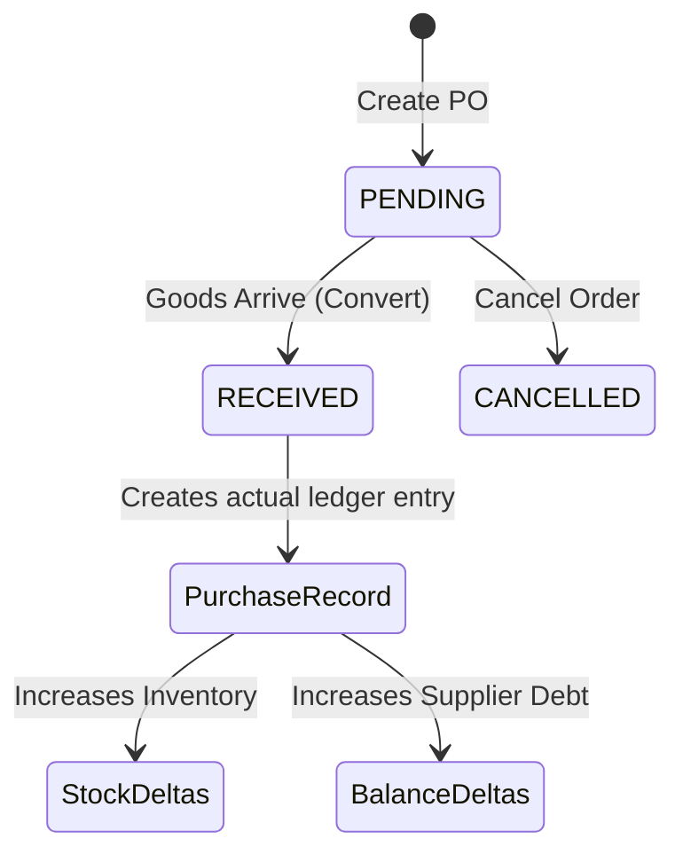

# Purchase Orders (PO Management) Technical Documentation

The **Purchase Order (PO)** module is a proactive inventory forecasting tool. While "Purchases" track goods that have already arrived with an invoice, "Purchase Orders" track goods that the shop owner has requested from a distributor but has not yet received.

---

## 1. Core Architecture
The PO system operates independently of the active Ledger and inventory totals until the goods are physically received. This prevents "Ghost Stock" distortion.

### Data Model
- **Header Table**: `purchase_orders` (Stores summary, status, and supplier link).
- **Items Table**: `purchase_order_items` (Stores line items with planned prices).

### State Machine (`status`):
- **PENDING**: The PO has been created and sent to the supplier. No stock or financial balances are altered.
- **RECEIVED**: The supplier has delivered the goods. The PO is seamlessly converted into a live **Purchase**.
- **CANCELLED**: The order was voided; no stock or financial impact.

---

## 2. Key Technical Features

### Sequential Number Generation
PO numbers follow a standardized format: `PO-[YEAR]-[SEQUENCE]` (e.g., `PO-2024-0012`).
- **Logic**: `PurchaseOrderRepository` scans for the highest sequence in the current year and increments by 1.
- **Benefit**: Ensures chronological auditability and aligns with physical filing systems.

### Supplier Name Snapshotting
To prevent data distortion if a supplier is renamed or deleted, the system stores a `supplier_name_snapshot` inside the `purchase_orders` table.
- **Impact**: Historical POs always display the vendor name as it was at the time of order, maintaining integrity for tax and audit purposes.

### Atomic Persistence
Every PO creation is wrapped in a **Database Transaction**. 
- **Mechanism**: Header and all Line Items are inserted in a single block. If any item fails validation, the entire header is rolled back.

---

## 3. The Lifecycle Flow

### Step 1: Creation (`PurchaseOrderService.create()`)
- A unique `po_number` is generated.
- `supplier_name_snapshot` is recorded.
- Expected items, quantities, and planned purchase prices are drafted.

### Step 2: Distribution
- POs can be exported to A4 PDF, including store metadata (Billing Address, GSTIN).
- Supported sharing via Email or WhatsApp integration.

### Step 3: Fulfillment (Receiving)
A single click operation in the UI invokes the conversion logic:
1. Fetch PO details via `getPurchaseOrderById`.
2. Map data to the `RecordPurchaseInput` structure.
3. Invoke `PurchaseService.recordPurchase()`.
4. **Result**: Supplier balance is updated, stock is incremented, and PO status is set to `RECEIVED`.

---

## 4. Future Roadmap: Auto-Ordering
The architecture supports linking `low_stock_alert` thresholds to the PO API, enabling one-click "Restock POs" for specific distributors based on historical supply chains.
