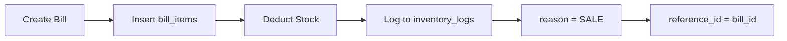
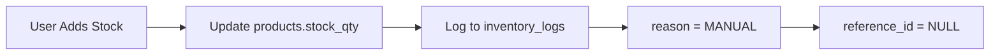
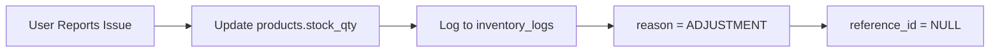

# Inventory Logs Table Design

## Overview

The `inventory_logs` table provides a **complete, immutable audit trail** of all stock changes. Every stock modification is logged with reason, reference, and timestamp.

---

## Table Definition

```sql
CREATE TABLE inventory_logs (
  id INTEGER PRIMARY KEY AUTOINCREMENT,
  product_id INTEGER NOT NULL,
  change_qty INTEGER NOT NULL,
  reason TEXT NOT NULL CHECK(reason IN ('SALE', 'MANUAL', 'ADJUSTMENT')),
  reference_id INTEGER,
  notes TEXT,
  created_at TEXT NOT NULL DEFAULT (datetime('now')),
  FOREIGN KEY (product_id) REFERENCES products(id) ON DELETE RESTRICT
);
```

---

## Column Specifications

### Primary Key

| Column | Type | Constraints | Description |
|--------|------|-------------|-------------|
| `id` | INTEGER | PRIMARY KEY AUTOINCREMENT | Unique log entry identifier |

---

### Product Reference

| Column | Type | Constraints | Description |
|--------|------|-------------|-------------|
| `product_id` | INTEGER | NOT NULL, FOREIGN KEY | Reference to products table |

**Foreign Key Constraint:**
```sql
FOREIGN KEY (product_id) REFERENCES products(id) ON DELETE RESTRICT
```

**Why RESTRICT:**
- Cannot delete product if it has inventory history
- Audit requirement (historical data must remain valid)
- Forces soft delete approach

---

### Stock Change

| Column | Type | Constraints | Description |
|--------|------|-------------|-------------|
| `change_qty` | INTEGER | NOT NULL | Quantity change (positive or negative) |

**Design Choices:**

**Positive/Negative Values:**
- **Positive** = Stock increase (purchase, return, correction)
- **Negative** = Stock decrease (sale, damage, theft)

**Examples:**

| Value | Meaning | Scenario |
|-------|---------|----------|
| `+50` | Added 50 units | Purchased stock from supplier |
| `-2` | Removed 2 units | Sold 2 units to customer |
| `+3` | Added 3 units | Stock count correction (found extra) |
| `-5` | Removed 5 units | Damaged goods |

**Why allow both positive and negative:**
- Single field captures direction (simpler than separate increase/decrease fields)
- Easy to calculate total change: `SUM(change_qty)`
- Clear semantics (+ = in, - = out)

---

### Reason for Change

| Column | Type | Constraints | Description |
|--------|------|-------------|-------------|
| `reason` | TEXT | NOT NULL, CHECK constraint | Reason category for stock change |

**Allowed Values:**
```sql
CHECK(reason IN ('SALE', 'MANUAL', 'ADJUSTMENT'))
```

| Reason | Meaning | Use Case | Automatic? |
|--------|---------|----------|------------|
| `SALE` | Stock decreased due to sale | Bill created | ✅ Yes |
| `MANUAL` | Manual stock update | Purchase, initial stock entry | ❌ No |
| `ADJUSTMENT` | Stock correction | Damage, theft, count mismatch | ❌ No |

**Design Choices:**

**Why these three categories:**
- **SALE:** Automatic logging (triggered by bill creation)
- **MANUAL:** User-initiated stock additions (purchases, restocking)
- **ADJUSTMENT:** Corrections (damage, theft, physical count mismatch)

**Why not more granular:**
- Simplicity (3 categories cover all scenarios)
- Additional context in `notes` field
- Can add more reasons later if needed

**Future Enhancement:**
```sql
-- Add more reasons
ALTER TABLE inventory_logs DROP CONSTRAINT check_reason;
ALTER TABLE inventory_logs ADD CONSTRAINT check_reason 
  CHECK(reason IN ('SALE', 'PURCHASE', 'RETURN', 'DAMAGE', 'THEFT', 'ADJUSTMENT'));
```

---

### Reference Linking

| Column | Type | Constraints | Description |
|--------|------|-------------|-------------|
| `reference_id` | INTEGER | NULL allowed | Reference to source transaction |

**Design Choices:**

**Reference Mapping:**

| Reason | reference_id | Meaning |
|--------|--------------|---------|
| `SALE` | `bill_id` | Link to bills table |
| `MANUAL` | `NULL` | No reference (manual entry) |
| `ADJUSTMENT` | `NULL` | No reference (correction) |

**Why nullable:**
- Not all stock changes have a reference
- Manual entries and adjustments are standalone

**Why no foreign key constraint:**
- Flexible reference (could point to bills, purchases, returns in future)
- Avoids circular dependency issues
- Application enforces referential integrity

**Example:**
```typescript
// Sale: reference_id = bill_id
db.execute(`
  INSERT INTO inventory_logs (product_id, change_qty, reason, reference_id, notes)
  VALUES (?, ?, 'SALE', ?, ?)
`, [productId, -quantity, billId, `Bill #${billNumber}`]);

// Manual: reference_id = NULL
db.execute(`
  INSERT INTO inventory_logs (product_id, change_qty, reason, reference_id, notes)
  VALUES (?, ?, 'MANUAL', NULL, ?)
`, [productId, quantity, 'Purchased from supplier']);
```

---

### Optional Notes

| Column | Type | Constraints | Description |
|--------|------|-------------|-------------|
| `notes` | TEXT | NULL allowed | Additional context |

**Design Choices:**

**Use Cases:**
- Explain manual adjustments
- Record supplier details for purchases
- Document damage/theft incidents
- Link to bill number for sales

**Examples:**
- `"Purchased 50 units from Supplier ABC"`
- `"Damaged during transport - 5 units lost"`
- `"Physical count mismatch - added 3 units"`
- `"Bill #BILL-20260208-0001"`

---

### Audit Timestamp

| Column | Type | Constraints | Description |
|--------|------|-------------|-------------|
| `created_at` | TEXT | NOT NULL | Log entry timestamp (ISO 8601) |

**No `updated_at`:**
- Logs are **immutable** (append-only)
- Never update or delete log entries
- Audit requirement

---

## Indexes

### Performance Indexes

```sql
-- Product inventory history
CREATE INDEX idx_inventory_logs_product_id ON inventory_logs(product_id);

-- Date-based reports
CREATE INDEX idx_inventory_logs_created_at ON inventory_logs(created_at);

-- Reason filtering
CREATE INDEX idx_inventory_logs_reason ON inventory_logs(reason);

-- Reference lookup
CREATE INDEX idx_inventory_logs_reference_id ON inventory_logs(reference_id);
```

---

## Audit Flow

### Flow 1: Sale (Automatic)



**Implementation:**
```typescript
// Transaction: Create bill + log inventory
db.transaction(() => {
  // 1. Create bill
  const billId = db.execute(`INSERT INTO bills (...) VALUES (...)`).lastInsertRowid;
  
  // 2. Insert bill items
  items.forEach(item => {
    db.execute(`INSERT INTO bill_items (...) VALUES (...)`, [...]);
    
    // 3. Deduct stock
    db.execute(`
      UPDATE products 
      SET stock_qty = stock_qty - ?, updated_at = datetime('now')
      WHERE id = ?
    `, [item.quantity, item.product_id]);
    
    // 4. Log inventory change
    db.execute(`
      INSERT INTO inventory_logs (product_id, change_qty, reason, reference_id, notes)
      VALUES (?, ?, 'SALE', ?, ?)
    `, [item.product_id, -item.quantity, billId, `Bill #${billNumber}`]);
  });
});
```

**Key Points:**
- ✅ Atomic transaction (all or nothing)
- ✅ Automatic logging (no manual intervention)
- ✅ Linked to bill (reference_id = bill_id)

---

### Flow 2: Manual Stock Addition (Purchase)



**Implementation:**
```typescript
// Transaction: Update stock + log
db.transaction(() => {
  // 1. Update stock
  db.execute(`
    UPDATE products 
    SET stock_qty = stock_qty + ?, updated_at = datetime('now')
    WHERE id = ?
  `, [quantity, productId]);
  
  // 2. Log inventory change
  db.execute(`
    INSERT INTO inventory_logs (product_id, change_qty, reason, reference_id, notes)
    VALUES (?, ?, 'MANUAL', NULL, ?)
  `, [productId, quantity, notes]);
});
```

**Key Points:**
- ✅ User-initiated
- ✅ No reference (standalone entry)
- ✅ Notes explain context

---

### Flow 3: Stock Adjustment (Damage/Theft)



**Implementation:**
```typescript
// Transaction: Adjust stock + log
db.transaction(() => {
  // 1. Update stock (decrease for damage)
  db.execute(`
    UPDATE products 
    SET stock_qty = stock_qty + ?, updated_at = datetime('now')
    WHERE id = ?
  `, [changeQty, productId]); // changeQty is negative for damage
  
  // 2. Log inventory change
  db.execute(`
    INSERT INTO inventory_logs (product_id, change_qty, reason, reference_id, notes)
    VALUES (?, ?, 'ADJUSTMENT', NULL, ?)
  `, [productId, changeQty, notes]);
});
```

**Key Points:**
- ✅ Correction mechanism
- ✅ Detailed notes required
- ✅ Audit trail preserved

---

## No Silent Stock Changes

> [!IMPORTANT]
> **Critical Principle: No Silent Changes**
> 
> Every stock change MUST be logged to `inventory_logs`. No exceptions.
> 
> **Enforcement:**
> - Application logic ensures logging
> - Database triggers (optional, for extra safety)
> - Code review checks

**Enforcement via Trigger (Optional):**
```sql
-- Trigger to prevent direct stock updates without logging
CREATE TRIGGER prevent_silent_stock_change
BEFORE UPDATE ON products
FOR EACH ROW
WHEN NEW.stock_qty != OLD.stock_qty
BEGIN
  -- This trigger will fire on stock changes
  -- Application must ensure inventory_logs entry exists
  -- (Cannot enforce in trigger due to transaction order)
  SELECT RAISE(FAIL, 'Stock changes must be logged to inventory_logs');
END;
```

**Note:** Triggers add complexity. Better to enforce in application layer with code reviews.

---

## Usage Examples

### Log Sale (Automatic)

```typescript
// Inside bill creation transaction
db.execute(`
  INSERT INTO inventory_logs (product_id, change_qty, reason, reference_id, notes)
  VALUES (?, ?, 'SALE', ?, ?)
`, [productId, -quantity, billId, `Bill #${billNumber}`]);
```

### Log Purchase (Manual)

```typescript
db.transaction(() => {
  // Update stock
  db.execute(`UPDATE products SET stock_qty = stock_qty + ? WHERE id = ?`, [50, productId]);
  
  // Log
  db.execute(`
    INSERT INTO inventory_logs (product_id, change_qty, reason, reference_id, notes)
    VALUES (?, ?, 'MANUAL', NULL, ?)
  `, [productId, 50, 'Purchased from Supplier ABC']);
});
```

### Log Adjustment (Damage)

```typescript
db.transaction(() => {
  // Update stock
  db.execute(`UPDATE products SET stock_qty = stock_qty - ? WHERE id = ?`, [5, productId]);
  
  // Log
  db.execute(`
    INSERT INTO inventory_logs (product_id, change_qty, reason, reference_id, notes)
    VALUES (?, ?, 'ADJUSTMENT', NULL, ?)
  `, [productId, -5, 'Damaged during transport']);
});
```

### View Product Inventory History

```typescript
const history = db.queryAll(`
  SELECT 
    change_qty,
    reason,
    notes,
    created_at
  FROM inventory_logs
  WHERE product_id = ?
  ORDER BY created_at DESC
`, [productId]);
```

### Calculate Stock from Logs (Verification)

```typescript
const calculated = db.queryOne(`
  SELECT SUM(change_qty) as total_change
  FROM inventory_logs
  WHERE product_id = ?
`, [productId]);

const current = db.queryOne(`
  SELECT stock_qty FROM products WHERE id = ?
`, [productId]);

// Verify: current stock should match sum of all changes
if (current.stock_qty !== calculated.total_change) {
  console.error('Stock mismatch detected!');
}
```

---

## Summary

| Aspect | Design Choice | Rationale |
|--------|---------------|-----------|
| **Audit trail** | Complete, immutable | Every change logged, no deletions |
| **Change tracking** | Positive/negative `change_qty` | Simple, clear direction |
| **Reason categories** | SALE, MANUAL, ADJUSTMENT | Covers all scenarios |
| **Reference linking** | Optional `reference_id` | Links sales to bills |
| **Notes** | Optional TEXT field | Context for manual changes |
| **Enforcement** | Application layer | No silent stock changes allowed |

**The inventory_logs table provides complete audit compliance and stock change transparency!**
