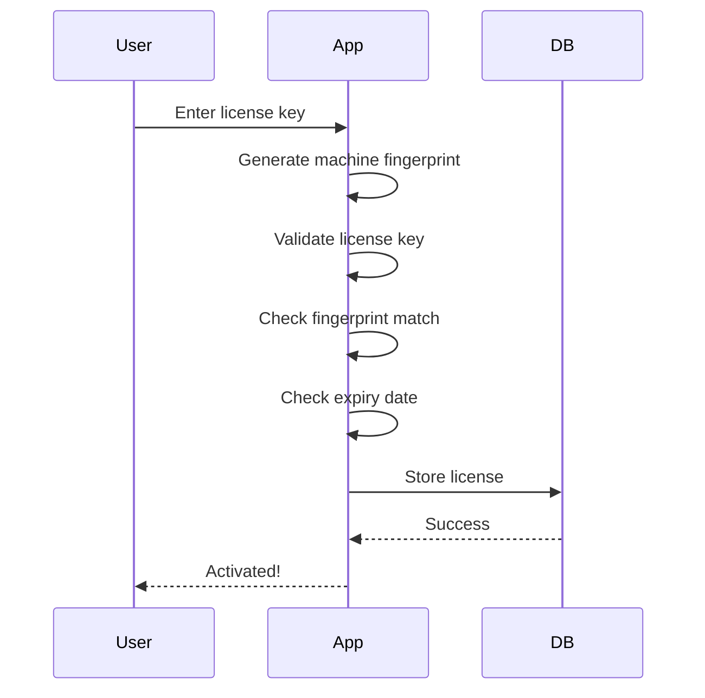

# License Table Design

## Overview

The `license` table provides **offline license enforcement** for the POS application. This is a **single-row table** that stores activation and expiry information.

> [!WARNING]
> **Security Disclaimer**
> 
> This provides basic offline license enforcement. Determined users can bypass any client-side licensing.
> 
> **For critical protection:**
> - Use code obfuscation
> - Sign executables with code signing certificate
> - Implement additional server-side validation (optional online check)
> - Consider hardware dongles for high-value deployments

---

## Table Definition

```sql
CREATE TABLE license (
  id INTEGER PRIMARY KEY CHECK(id = 1),
  license_key TEXT NOT NULL UNIQUE,
  activated_at TEXT NOT NULL DEFAULT (datetime('now')),
  expires_at TEXT NOT NULL,
  machine_fingerprint TEXT NOT NULL,
  created_at TEXT NOT NULL DEFAULT (datetime('now')),
  updated_at TEXT NOT NULL DEFAULT (datetime('now'))
);
```

---

## Column Specifications

| Column | Type | Constraints | Description |
|--------|------|-------------|-------------|
| `id` | INTEGER | PRIMARY KEY, CHECK(id = 1) | Always 1 (single row) |
| `license_key` | TEXT | NOT NULL, UNIQUE | Encrypted license key |
| `activated_at` | TEXT | NOT NULL | Activation timestamp |
| `expires_at` | TEXT | NOT NULL | Expiry timestamp |
| `machine_fingerprint` | TEXT | NOT NULL | Hardware identifier |
| `created_at` | TEXT | NOT NULL | Creation timestamp |
| `updated_at` | TEXT | NOT NULL | Last update timestamp |

---

## Design Choices

### 1. Single Row Table

**Enforcement:**
```sql
id INTEGER PRIMARY KEY CHECK(id = 1)
```

**Why:**
- Only one license per installation
- Prevents multiple license entries
- Simplifies license checks

**Usage:**
```typescript
// Always query id = 1
const license = db.queryOne(`SELECT * FROM license WHERE id = 1`);

// Always insert/update id = 1
db.execute(`
  INSERT INTO license (id, license_key, expires_at, machine_fingerprint)
  VALUES (1, ?, ?, ?)
  ON CONFLICT(id) DO UPDATE SET
    license_key = excluded.license_key,
    expires_at = excluded.expires_at,
    machine_fingerprint = excluded.machine_fingerprint,
    updated_at = datetime('now')
`, [licenseKey, expiresAt, fingerprint]);
```

---

### 2. License Key Format

**Structure:**
```
LICENSE-KEY = BASE64(ENCRYPT(PAYLOAD + SIGNATURE))

PAYLOAD = {
  "expires": "2027-02-08T00:00:00Z",
  "fingerprint": "ABC123...",
  "features": ["pos", "inventory", "reports"]
}

SIGNATURE = HMAC-SHA256(PAYLOAD, SECRET_KEY)
```

**Example:**
```
FULL-XYZ789-UVW456-RST123-MNO345
```

**Why encrypted:**
- Prevents tampering with expiry date
- Prevents license transfer (fingerprint embedded)
- Signature validates authenticity

**Generation (Server-side):**
```typescript
function generateLicenseKey(expiresAt: string, fingerprint: string): string {
  const payload = {
    expires: expiresAt,
    fingerprint: fingerprint,
    features: ['pos', 'inventory', 'reports']
  };
  
  const signature = crypto
    .createHmac('sha256', SECRET_KEY)
    .update(JSON.stringify(payload))
    .digest('hex');
  
  const data = { ...payload, signature };
  const encrypted = encrypt(JSON.stringify(data), ENCRYPTION_KEY);
  const encoded = Buffer.from(encrypted).toString('base64');
  
  return formatLicenseKey(encoded); // Add dashes for readability
}
```

**Validation (Client-side):**
```typescript
function validateLicenseKey(licenseKey: string, currentFingerprint: string): boolean {
  try {
    // Decode and decrypt
    const encoded = licenseKey.replace(/-/g, '');
    const encrypted = Buffer.from(encoded, 'base64');
    const decrypted = decrypt(encrypted, ENCRYPTION_KEY);
    const data = JSON.parse(decrypted);
    
    // Verify signature
    const { signature, ...payload } = data;
    const expectedSignature = crypto
      .createHmac('sha256', SECRET_KEY)
      .update(JSON.stringify(payload))
      .digest('hex');
    
    if (signature !== expectedSignature) {
      return false; // Tampered license
    }
    
    // Check expiry
    if (new Date(data.expires) < new Date()) {
      return false; // Expired
    }
    
    // Check machine fingerprint
    if (data.fingerprint !== currentFingerprint) {
      return false; // Wrong machine
    }
    
    return true;
  } catch (error) {
    return false; // Invalid license
  }
}
```

---

### 3. Machine Fingerprint

**Purpose:**
- Bind license to specific hardware
- Prevent license transfer to different machines

**Generation:**
```typescript
import { machineIdSync } from 'node-machine-id';
import crypto from 'crypto';

function generateMachineFingerprint(): string {
  // Use node-machine-id (stable across reboots)
  const machineId = machineIdSync();
  
  // Hash for privacy (don't store raw hardware IDs)
  const fingerprint = crypto
    .createHash('sha256')
    .update(machineId)
    .digest('hex')
    .substring(0, 32);
  
  return fingerprint;
}
```

**What it includes:**
- CPU ID
- MAC address
- Motherboard serial
- Disk serial

**Stability:**
- ✅ Survives OS reinstall
- ✅ Survives software updates
- ❌ Changes if hardware replaced

**Handling Hardware Changes:**
```typescript
function checkLicense(): LicenseStatus {
  const license = db.queryOne(`SELECT * FROM license WHERE id = 1`);
  
  if (!license) {
    return { valid: false, reason: 'NO_LICENSE' };
  }
  
  const currentFingerprint = generateMachineFingerprint();
  
  if (license.machine_fingerprint !== currentFingerprint) {
    // Hardware changed - require reactivation
    return { valid: false, reason: 'HARDWARE_CHANGED' };
  }
  
  if (new Date(license.expires_at) < new Date()) {
    return { valid: false, reason: 'EXPIRED' };
  }
  
  return { valid: true };
}
```

---

### 4. Expiry Timestamp

**Format:** ISO 8601 (`2027-02-08 00:00:00`)

**Types of Licenses:**

| Type | expires_at | Use Case |
|------|------------|----------|
| **Trial** | `datetime('now', '+30 days')` | 30-day trial |
| **Annual** | `datetime('now', '+1 year')` | Yearly subscription |
| **Perpetual** | `'2099-12-31 23:59:59'` | Lifetime license |

**Checking Expiry:**
```typescript
function isLicenseExpired(): boolean {
  const license = db.queryOne(`SELECT expires_at FROM license WHERE id = 1`);
  
  if (!license) {
    return true; // No license = expired
  }
  
  return new Date(license.expires_at) < new Date();
}
```

---

## Offline License Strategy

### Activation Flow



**Implementation:**
```typescript
async function activateLicense(licenseKey: string): Promise<ActivationResult> {
  // 1. Generate machine fingerprint
  const fingerprint = generateMachineFingerprint();
  
  // 2. Validate license key
  if (!validateLicenseKey(licenseKey, fingerprint)) {
    return { success: false, error: 'Invalid license key' };
  }
  
  // 3. Decode license to get expiry
  const licenseData = decodeLicenseKey(licenseKey);
  
  // 4. Store in database
  db.execute(`
    INSERT INTO license (id, license_key, expires_at, machine_fingerprint)
    VALUES (1, ?, ?, ?)
    ON CONFLICT(id) DO UPDATE SET
      license_key = excluded.license_key,
      expires_at = excluded.expires_at,
      machine_fingerprint = excluded.machine_fingerprint,
      updated_at = datetime('now')
  `, [licenseKey, licenseData.expires, fingerprint]);
  
  return { success: true };
}
```

---

### Startup Verification

```typescript
async function verifyLicenseOnStartup(): Promise<void> {
  const license = db.queryOne(`SELECT * FROM license WHERE id = 1`);
  
  if (!license) {
    // No license - show activation dialog
    showActivationDialog();
    return;
  }
  
  const currentFingerprint = generateMachineFingerprint();
  
  // Check machine fingerprint
  if (license.machine_fingerprint !== currentFingerprint) {
    showError('License is bound to different hardware. Please reactivate.');
    showActivationDialog();
    return;
  }
  
  // Check expiry
  if (new Date(license.expires_at) < new Date()) {
    showError('License has expired. Please renew.');
    showActivationDialog();
    return;
  }
  
  // License valid - proceed
  console.log('License valid until:', license.expires_at);
}
```

---

### Runtime Checks

```typescript
// Check license periodically (every hour)
setInterval(() => {
  if (isLicenseExpired()) {
    showError('License has expired during runtime.');
    app.quit();
  }
}, 60 * 60 * 1000); // 1 hour
```

---

## Tamper Resistance

### 1. Encrypted License Key

**Protection:**
- License key contains encrypted payload
- Signature prevents tampering
- Expiry date embedded in encrypted data

**Attack:** User modifies `expires_at` in database

**Defense:** License key validation fails (signature mismatch)

---

### 2. Machine Fingerprint

**Protection:**
- License bound to specific hardware
- Prevents sharing license with others

**Attack:** User copies database to different machine

**Defense:** Fingerprint mismatch, activation required

---

### 3. Database Encryption (Optional)

**Protection:**
- Encrypt entire database file
- Prevents direct database modification

**Implementation:**
```typescript
// Use SQLCipher (encrypted SQLite)
import Database from 'better-sqlite3';

const db = new Database('smartkhata.db');
db.pragma('key = "your-encryption-key"');
```

**Limitation:** Encryption key must be stored in application (can be extracted)

---

### 4. Code Obfuscation

**Protection:**
- Obfuscate license validation code
- Makes reverse engineering harder

**Tools:**
- JavaScript Obfuscator
- Webpack obfuscation plugins

---

### 5. Integrity Checks

**Protection:**
- Verify database hasn't been tampered with
- Check license table hash

**Implementation:**
```typescript
function verifyDatabaseIntegrity(): boolean {
  const license = db.queryOne(`SELECT * FROM license WHERE id = 1`);
  
  // Calculate hash of license data
  const hash = crypto
    .createHash('sha256')
    .update(JSON.stringify(license))
    .digest('hex');
  
  // Compare with stored hash (in application code or separate file)
  return hash === EXPECTED_HASH;
}
```

---

## Limitations

> [!CAUTION]
> **Client-Side Licensing Limitations**
> 
> Any client-side licensing can be bypassed by determined users:
> - Database can be modified
> - Code can be patched
> - Validation can be disabled
> 
> **This is acceptable for:**
> - Small businesses (trust-based)
> - Low-value software
> - Offline-first requirements
> 
> **Not suitable for:**
> - High-value software
> - Untrusted environments
> - Critical license enforcement

---

## Summary

| Aspect | Design Choice | Rationale |
|--------|---------------|-----------|
| **Structure** | Single row table | One license per installation |
| **License key** | Encrypted + signed | Tamper-resistant |
| **Machine binding** | Hardware fingerprint | Prevent license sharing |
| **Expiry** | Embedded in license key | Offline verification |
| **Validation** | Startup + periodic checks | Continuous enforcement |
| **Security** | Basic offline protection | Acceptable for kirana shops |

**The license table provides reasonable offline license enforcement for a trust-based POS system!**
