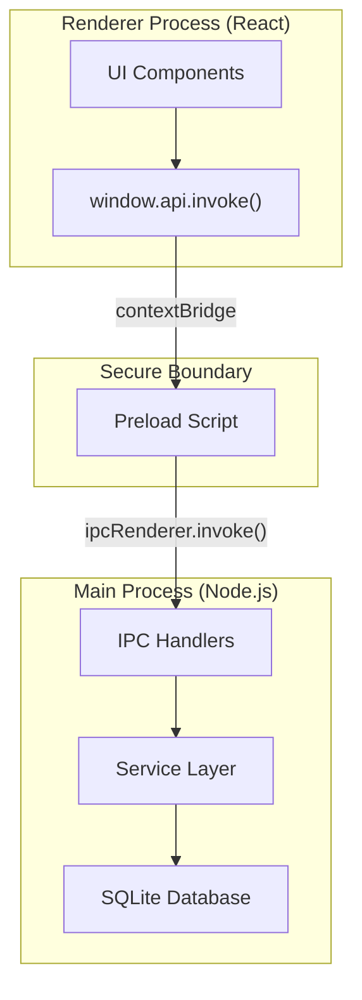

# Preload Script & Secure IPC Bridge

The preload script (`src/preload/index.ts`) is a **secure, context-isolated bridge** between the Electron main process and the React renderer. It uses `contextBridge` to expose a controlled API to the renderer without giving it direct access to Node.js or Electron internals.

---

## 🏗️ Architecture & Security Model



### Security Guarantees
1. **Isolated Context**: The renderer has no access to the `ipcRenderer` directly. It can only call the exposed `invoke` method.
2. **Channel Whitelist**: The preload script validates every channel against the `IPC_CHANNELS` registry before forwarding to the main process.
3. **No Node.js Leakage**: Core modules like `fs` or `child_process` are never exposed to the renderer.

---

## 🛠️ Implementation Detail

### Preload Entry Point (`src/preload/index.ts`)
The implementation uses a generic `invoke` method that acts as a gatekeeper.

```typescript
import { contextBridge, ipcRenderer } from 'electron';
import { IPC_CHANNELS } from '../shared/ipc/channels';

contextBridge.exposeInMainWorld('api', {
  invoke: async <T>(channel: string, payload?: unknown): Promise<IPCResponse<T>> => {
    // 1. Channel Validation
    const validChannels = Object.values(IPC_CHANNELS);
    if (!validChannels.includes(channel as any)) {
      console.error(`[Preload] Blocked invalid channel: ${channel}`);
      return { success: false, error: `Invalid IPC channel: ${channel}` };
    }

    // 2. Forward to Main
    try {
      return await ipcRenderer.invoke(channel, payload);
    } catch (error: any) {
      return { success: false, error: error.message };
    }
  }
});
```

### Type Definition (`src/renderer/vite-env.d.ts`)
To ensure full IDE support and type safety in the React layer:

```typescript
declare global {
  interface Window {
    api: {
      invoke: <T = unknown>(
        channel: string,
        payload?: unknown
      ) => Promise<IPCResponse<T>>;
    };
  }
}
```

---

## 🎣 Usage Guide

### Simple Data Fetching
```typescript
const response = await window.api.invoke<Product[]>('product:list');
if (response.success) {
  setProducts(response.data);
}
```

### Creating Data with Payload
```typescript
const response = await window.api.invoke('product:create', {
  name: "New Product",
  price: 450
});
```

---

## 🛡️ Anti-Exploit Checklist
- [x] **Registry-only**: Only channels defined in `src/shared/ipc/channels.ts` are callable.
- [x] **Standardized Response**: All methods return `{ success: boolean, data?: T, error?: string }`.
- [x] **No Sync Methods**: All IPC is asynchronous to prevent blocking the UI thread.
- [x] **Sanitization**: Arguments are serialized through Electron's structured clone algorithm.

---

**Last Updated**: 2026-02-28
**Files**: `src/preload/index.ts`, `src/shared/ipc/channels.ts`
